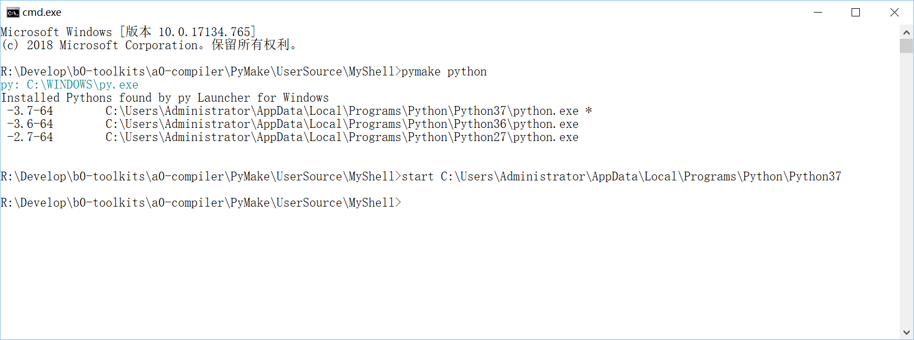

# pymake  

## 遇到的问题  
1. 打开命令行，需要查找自己写的脚本，需要切换工作目录，需要调用固定名字的命令，需要现配置环境。
2. 命令不丰富，命令步很复杂，需要写脚本，难道到处带着它，随时拷贝一下？
3. 需要切换好几个环境，可是一次只能配置一个？命令行，总这样。  
4. 路径繁杂，每次都要拷贝PATH路径。  
5. 自动化脚本写了一遍又一遍，可是还得再写一遍。  
6. 不兼容，路径不兼容、环境变量不兼容，命令不兼容，很痛苦。

## 思考过程  
制定一个目标，实现它。  
既然命令行那么难配置环境，就要用个容易配置的办法，写脚本增删路径，写多个脚本，一个脚本一个环境。不行需要找脚本路径，不方便。   
命令行写多个环境配置挺复杂的，换个工具来实现吧，反证，只要把环境配置出来就行，找个脚本语言，都是脚本，不在乎运行速率。  
使用Python，Python优美、典雅、丰富、高效。    
1. 组织数据结构，  
2. 寻找相应的办法，实现丰富的命令，
3. 测试，
4. 使用中，继续完善，
5. 多更新几版，表达其完善度。  
6. 发布。   

## 解决方法  
使用pymake，初始，摁着电脑，配置一次路径集、环境集、命令集，命令集随时可以扩充。在工作目录打开命令行，哦，到这里工作基本上就要做完了。执行下命令，去喝茶。    
1. 没错，只有一步，在工作目录打开命令行，工作基本上就要做完了。  
2. 输入一条命令。  
3. 命令简写，还带参数。  

```shell

#获取所有的PyMake信息，包含环境配置在哪里、是哪个配置文件（一般为一台电脑的某组配置）、程序目录、PORT目录、程序配置目录。
#包含当前环境、安装路径。
pymake get all

#获取环境配置SOURCE
pymake source

#获取当前env
pymake get cur env

#查看env
pymake env

#查看cmd
pymake see 
pymake use <env> see

#查看path
pymake list path

#设置默认环境
pymake set cur env

#导出一个环境
pymake export

#导出一个带“在sourceroot里自定义的”环境的环境
pymake export2

#导出一个命令（其实是个命令步的集合）
pymake type
pymake use <env> type

#执行命令
pymake exec 
pymake use <env> exec
pymake execvp 
pymake use <env> execvp

#备份所有环境配置到zip。
pymake backup

#从zip还原所有的备份环境。
pymake recovery

#重置PyMake
pymake initialize

#传输源环境配置文件的信息到目标环境配置文件
pymake port
pymake translate

#导入命令脚本为内部命令
pymake import

#--------------------------------------------------------------------------------
#设置环境、PATH、CMD具体内容
pymake set

#查看是否包含某环境、PATH、CMD名
pymake have

#清理执行后的残余脚本，包含_exec.bat, _effect.bat, _unset.bat ...
pymake clean

#获取程序信息
pymake program

#其他的命令都是别名
#pymm, mm是pymake的别名。  

```


``` shell
#查看PyMake提供的local环境
pymake local 

#开启“在sourceroot里定义的”自定义环境
pymake custom open

#假设shellroot里有shat.bat，现在在随意的目录里打算执行他。  
pymake exec shat

#希望在当前目录执行他。
pymake exec here shat

#希望在某个任意的目录执行他。
pymake exec-with-params shat --workroot "xxx-path"

#希望带参数执行他。
pymake exec-with-params shat --params "xxxx xxxx xxxx"  

#希望满足多个条件执行他。
pymake exec-with-params [ here ] shat --params="xxxx" --workroot="xxx"

``` 

```powershell

#希望使用powershell执行器执行命令
pymake powershell 

#命令别名
pypowershell

```

```cmd
#查看系统环境 [system]
pymake system

#查看PyMake提供的环境
pymake local 

#查看自定义环境 [custom]
pymake custom

#查看独立环境 [separate]
pymake env current -r

# 另外一组查看环境的命令
pymake get all settings --local --custom --system --current --envname <env-name>

```

```cmd
# 使用其他语言执行命令
pymake language exec-with-params php --params xxx.php --params ...

#language命令的快捷方式
pylanguage php xxx.php ...

```

#### pymake使用截图  
##### env    
  

##### python    
  

# COMMAND LIST AND GLOZE    

|COMMAND|SYSTEM|LOCAL|CUSTOM|SEPARATE|
|----|----|----|-----|------|
|system exec-with-params| YES| | |
|system use env exec-with-params|YES| | |YES|
|custom exec-with-params|YES | YES[OPEN] |YES[OPEN]||
|custom use env exec-with-params|YES|YES[OPEN] |YES[OPEN]|YES|
|exec-with-params|YES|YES[OPEN] | YES[OPEN] |YES|
|use env exec-with-params|YES|YES[OPEN] | YES[OPEN]|YES|

