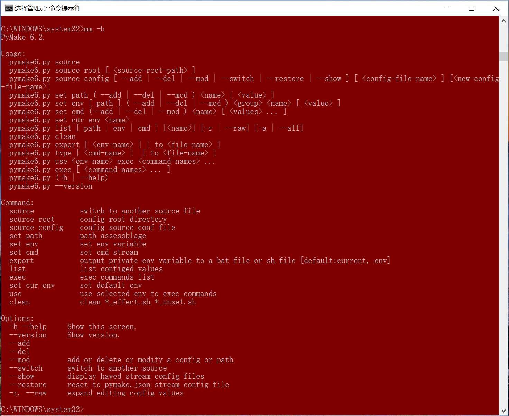
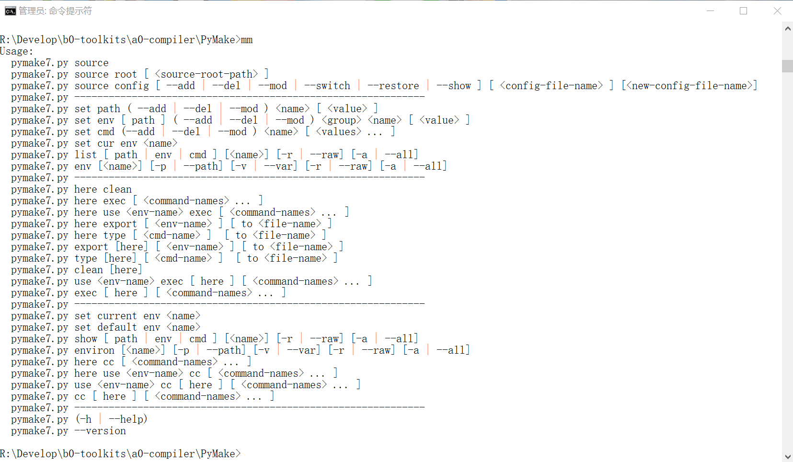
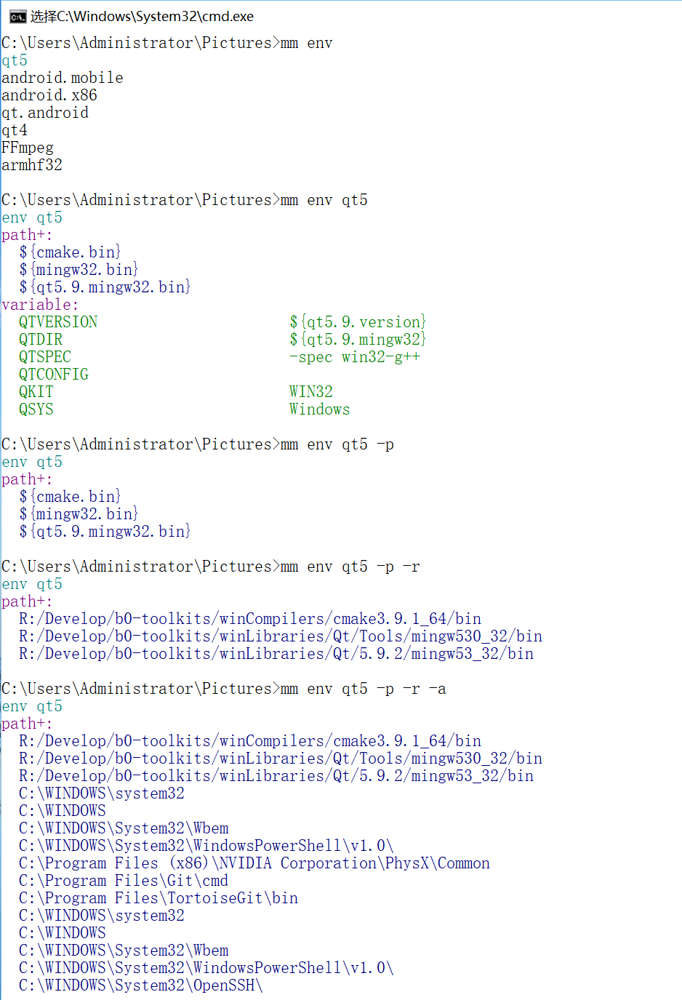

# PyMake  

- *If you'd like to make cross-platform project, but cmake can't build, it need to config running environment ?*
- *If you have issued want to depend some projects generated by cmake qmake autotools e.g but they all need to change not alike variable about environment across third platforms at least?*
- *Now pymake make beautiful, config once by use it any platforms.*  

# Install  

goto PyMake source directory。  

Windows:  
install.bat %*  

Unix:  
install.sh  

on console, use mm cc cmd-name to execute command stream。  

# Usage:  

## Version 1.0  
*work-store-directory>python path/to/pymake.py -h*

```shell
use source config: pymake.json
PyMake 1.0.

Usage:
  pymake.py source [ --delete | --add | --switch ] [ <config-file-name> ]
  pymake.py source [ --list | --restore ]
  pymake.py list-path [ --keys | --values ]
  pymake.py config ( --toolchain | --genmake | --make | --build ) <path>
  pymake.py other-bin ( --add | --del | --mod ) <name> [ <path> ]
  pymake.py (generate|build|install)
  pymake.py genmake <genmake-command>
  pymake.py (-h | --help)
  pymake.py --version

Command:
  source        switch to another config file
  genmake       execute genmake command after
  generate
  build
  install       pymake command
  config        config toolchain path
  list-path
  other-bin     modify the other bin path to env

Options:
  -h --help     Show this screen.
  --version     Show version.
  --add
  --del --delete
  --mod         add or delete or modify a config or path
  --switch      switch to another source
  --keys
  --values
  --toolchain   set toolchain path in source config file
  --build       set build directory in souce config file
  --genmake     set genmake directory in current souce
  --make        set make directory in current source config file
  --list        list haved source files
  --restore     reset to pymake.json source config file
```
*You can follow this tips to do configure thing. now it support cmake.*

## How to Configure  

### *From config file*  

```shell
pymake.ini

[pymake]
config = pymake.json

```
*it switch to current config file to do any make tasks*


```shell
pymake.json

{
    "add-to-env": {
        "PYMAKE_TOOLCHAIN_PATH": "C:/Users/Administrator/Qt/Tools/mingw530_32/bin", 
        "PYMAKE_GENMAKE_PATH": "Z:/abel/Develop/b0-toolskits/compliers/cmake3.9.1_64/bin",
        "PYMAKE_MAKE_PATH": "C:/Users/Administrator/Qt/Tools/mingw530_32/bin"
    }, 
    "source-to-build": {
        "PYMAKE_BUILD_PATH": "Z:/abel/Develop/a0-Developworkspace/a0-qqtpruduct-qqtfoundation/build", 
        "PYMAKE_GENMAKE_COMMAND": "cmake -G\"MinGW Makefiles\" ../", 
        "PYMAKE_MAKE_COMMAND": "mingw32-make", 
        "PYMAKE_INSTALL_COMMAND": "mingw32-make install"
    }, 
    "add-other-bin-path-to-env": {
        "qt5.9-win32": "C:/Users/Administrator/Qt/5.9.1/mingw53_32/bin"
    }
}
```
*I use json format to store the configure, it is easy to read. You can make some lot of by this file(also template) to create new building task file.*

### *From command-line*   

```shell
work-store-directory>python path/to/pymake.py ...
```

*from command-line, you can config all that path and command. program will follow configured file, chdir to build path, then execute your command to generate build install e.g. You can also execute genmake command raw from this program command-line.* 

# Version 6  
*You need install python3 (python2 is alse support, but suggest 3)*  
*You should use link to make a link mm to pymake.sh.*
*in windows, create mm.bat in windows dir call pymake.bat*  

*Firstly, you need set source root to store all of your source config file*  
*Secondly, config the source file, prepare to auto shell all your command*  

*any-direcotory>mm*

```shell
Usage:
  pymake6.py source
  pymake6.py source root [ <source-root-path> ]
  pymake6.py source config [ --add | --del | --mod | --switch | --restore | --show ] [ <config-file-name> ] [<new-config-file-name>]
  pymake6.py set path ( --add | --del | --mod ) <name> [ <value> ]
  pymake6.py set env cur <name>
  pymake6.py set env [ path ] ( --add | --del | --mod ) <group> <name> [ <value> ]
  pymake6.py set cmd (--add | --del | --mod ) <name> [ <values> ... ]
  pymake6.py export [ <name> ]
  pymake6.py list ( path | env | cmd ) [-r | --raw]
  pymake6.py k [ <name> ]
  pymake6.py (-h | --help)
  pymake6.py --version
```
*Program will make .pymake config root to config the pymake,*
*but, in windows it is set in appdata directory*

```bash
[pymake]

[source]
root = /Users/abel/Develop/c0-buildconfig
config = pymake6-mac.json
```
## Json file is Changed  
```shell
    "path-assemblage": {
        "root": "/Users/abel/Develop",
        "root.src": "${root}/a0-develop",
        "root.prod": "${root}/b1-product",
        "root.tool": "${root}/b0-toolskits",
        "root.build": "${root}/c0-buildstation",
        "root.test": "${root}/c2-test",
        "root.webrc": "${root}/c1-webrc",
        "cc": "${root.tool}/compiler",
        "cmake.bin": "${cc}/CMake.app/Contents/bin",
        "qt": "${root.tool}/macLibraries/Qt",
        "qt5.9.clang": "${qt}/5.9.1/clang_64",
        "qt5.8.android_x86": "${qt}/5.8/android_x86",
        "qt5.8.android_arm": "${qt}/5.8/android_armv7",
        "qt5.8.clang": "${qt}/5.8/clang_64",
        "qt5.8.ios": "${qt}/5.8/ios",
        "qt4.8.clang": "${qt}/4.8.7/clang_64",
        "qt5.9.clang.bin": "${qt}/5.9.1/clang_64/bin",
        "qt5.8.android_x86.bin": "${qt}/5.8/android_x86/bin",
        "qt5.8.android_arm.bin": "${qt}/5.8/android_armv7/bin",
        "qt5.8.clang.bin": "${qt}/5.8/clang_64/bin",
        "qt5.8.ios.bin": "${qt}/5.8/ios/bin",
        "qt4.8.clang.bin": "${qt}/4.8.7/clang_64/bin",
        "android": "${root.tool}/macAndroidLibraries",
        "android.sdk": "${android}/android-sdk-macosx",
        "android.ndk": "${android}/android-ndk-r13b",
        "android.ant": "${android}/apache-ant-1.10.1",
        "android.java": "${android}/java-macosx/Java/JavaVirtualMachines",
        "sdk.plat.tool": "${android.sdk}/platform-tools",
        "sdk.build.tool": "${android.sdk}/build-tools",
        "sdk.tool": "${android.sdk}/tools",
        "java1.7.home": "${android.java}/jdk1.7.0_79.jdk/Contents/Home",
        "java1.8.home": "${android.java}/jdk1.8.0_111.jdk/Contents/Home",
        "java1.9.home": "${android.java}/jdk9.jdk/Contents/Home",
        "java1.7.bin": "${java1.7.home}/bin",
        "java1.8.bin": "${java1.8.home}/bin",
        "java1.9.bin": "${java1.9.home}/bin",
        "ant.bin": "${android.ant}/bin",
        "ndk.arm": "${android.ndk}/toolchains/arm-linux-androideabi-4.9/prebuilt/darwin-x86_64",
        "ndk.x86": "${android.ndk}/toolchains/x86-4.9/prebuilt/darwin-x86_64",
        "ndk.x86_64": "${android.ndk}/toolchains/x86_64-4.9/prebuilt/darwin-x86_64",
        "ndk.arm.bin": "${ndk.arm}/bin",
        "ndk.x86.bin": "${ndk.x86}/bin",
        "ndk.x86_64.bin": "${ndk.x86_64}/bin",
        "mac.sdk": "/Applications/Xcode.app/Contents/Developer/Platforms/MacOSX.platform/Developer/SDKs/MacOSX.sdk/System/Library/Frameworks"
    },
    "environ": {
        "android.mobile": {
            "path+": [
                "${cmake.bin}",
                "${qt5.8.android_arm.bin}",
                "${java1.8.bin}",
                "${android.sdk}",
                "${sdk.plat.tool}",
                "${sdk.build.tool}",
                "${sdk.tool}",
                "${ant.bin}",
                "${ndk.arm.bin}"
            ],
            "ANDROID_API_VERSION": "android-23",
            "ANDROID_SDK_ROOT": "${android.sdk}",
            "ANDROID_NDK_ROOT": "${android.ndk}",
            "ANDROID_NDK_HOST": "darwin-x86_64",
            "ANDROID_NDK_TOOLCHAIN_PREFIX": "arm-linux-androideabi",
            "ANDROID_NDK_TOOLCHAIN_VERSION": "4.9",
            "ANDROID_NDK_PLATFORM": "android-23",
            "NDK_TOOLCHAIN_PATH": "${ndk.arm.bin}",
            "NDK_TOOLS_PREFIX": "arm-linux-androideabi",
            "PYMAKE_MYNAME": "T.D.R",
            "a_special_var_const": "hello world",
            "QKIT": "Android",
            "QTDIR": "${qt5.8.android_arm}",
            "QTSPEC": "android-g++",
            "QTCONFIG": "arm",
            "JAVA_HOME": "${java1.8.home}",
            "CLASSPATH": ".:${JAVA_HOME}/lib/dt/jar:${JAVA_HOME}/lib/tools.jar"
        },
        "android.x86": {
            "path+": [
                "${cmake.bin}",
                "${qt5.8.android_x86.bin}",
                "${java1.8.bin}",
                "${android.sdk}",
                "${sdk.plat.tool}",
                "${sdk.build.tool}",
                "${sdk.tool}",
                "${ant.bin}",
                "${ndk.x86.bin}"
            ],
            "CLICOLOR": "1",
            "ANDROID_API_VERSION": "android-23",
            "ANDROID_SDK_ROOT": "${android.sdk}",
            "ANDROID_NDK_ROOT": "${android.ndk}",
            "ANDROID_NDK_HOST": "darwin-x86_64",
            "ANDROID_NDK_TOOLCHAIN_PREFIX": "x86",
            "ANDROID_NDK_TOOLCHAIN_VERSION": "4.9",
            "ANDROID_NDK_PLATFORM": "android-23",
            "NDK_TOOLCHAIN_PATH": "${ndk.x86.bin}",
            "NDK_TOOLS_PREFIX": "i686-linux-android",
            "QKIT": "Android",
            "QTDIR": "${qt5.8.android_x86}",
            "QTSPEC": "android-g++",
            "QTCONFIG": "arm",
            "JAVA_HOME": "${java1.8.home}",
            "CLASSPATH": ".:${JAVA_HOME}/lib/dt/jar:${JAVA_HOME}/lib/tools.jar"
        },
        "qt.android": {
            "path+": [
                "${cmake.bin}",
                "${qt5.9.clang.bin}",
                "${java1.8.bin}",
                "${android.sdk}",
                "${sdk.plat.tool}",
                "${sdk.build.tool}",
                "${sdk.tool}",
                "${ant.bin}",
                "${ndk.arm.bin}"
            ],
            "ANDROID_API_VERSION": "android-23",
            "ANDROID_SDK_ROOT": "${android.sdk}",
            "ANDROID_NDK_ROOT": "${android.ndk}",
            "ANDROID_NDK_HOST": "darwin-x86_64",
            "ANDROID_NDK_TOOLCHAIN_PREFIX": "i686-linux-android",
            "ANDROID_NDK_TOOLCHAIN_VERSION": "4.9",
            "ANDROID_NDK_PLATFORM": "android-23",
            "NDK_TOOLCHAIN_PATH": "${ndk.arm.bin}",
            "NDK_TOOLS_PREFIX": "i686-linux-android",
            "QKIT": "macOS",
            "QTDIR": "${qt5.9.clang}",
            "QTSPEC": "macx-clang",
            "QTCONFIG": "x86_64",
            "JAVA_HOME": "${java1.8.home}",
            "CLASSPATH": ".:${JAVA_HOME}/lib/dt/jar:${JAVA_HOME}/lib/tools.jar"
        },
        "qt": {
            "path+": [
                "${cmake.bin}",
                "${qt5.9.clang.bin}"
            ],
            "QKIT": "macOS",
            "QTDIR": "${qt5.9.clang}",
            "QTSPEC": "macx-clang",
            "QTCONFIG": "x86_64"
        },
        "current": "qt.android"
    },
    "variable-assemblage": [
        "QQt",
        "a0-qqtfoundation",
        "${root.build}/${qqt.proj.name}/${qt.sys.mac}/${build.release}",
        "${root.src}/${qqt.proj.name}",
        "${qqt.proj.name}.pro",
        "${qqt.build.path}/src/bin",
        "${root.prod}/QQt",
        "qqtframe",
        "${qqt.build.path}/examples/${qqtframe.prod.name}/bin",
        "${qqt.build.path}/src/bin/QQt.framework",
        "QQt.framework/Versions/1/QQt",
        "${root.tool}/Source/qt5",
        "${root.build}/qt5",
        "androiddeployqt",
        "macdeployqt",
        "DownloadQueue",
        "/Users/abel/Develop/c1-webrc/DownloadQueue/DownloadQueue.pro",
        "${root.build}/${app.name}",
        "macdeployqt ${app.path.build}/${app.name}.app",
        "${prod.name}.app",
        "${mac.app}/Contents",
        "${mac.app.content}/MacOS",
        "${mac.app.content}/Frameworks",
        "${mac.app.content}/Resources",
        "${mac.app.content}/PlugIns",
        "${prod.name}.framework",
        "${prod.name}.framework/Versions",
        "${prod.name}.framework/Resources",
        "macdeployqt ${}"
    ],
    "command-assemblage": [
        "I'm not similar to these command, so list them here, rather than forgotten them",
        "cl-command, sys-command",
        "replace? no, append? easy!",
        "help you to remeber these command.",
        "mkdir -p ${qqt.build.path}",
        "cd ${build-path}",
        "cmake -G\"Unix Makefiles\" -DCMAKE_INSTALL_PREFIX=${prod-root} ${source-path}",
        "cmake -GXCode -DCMAKE_INSTALL_PREFIX=${prod-root} ${source-path}",
        "rm -f CMakeCache.txt",
        "qmake ${source-path}/${qmake-file} -spec ${QTSPEC} CONFIG+=${QTCONFIG} && make qmake_all",
        "make -j4",
        "make clean in ${build-path}",
        "make install",
        "${deployqt} ${bin-path}/${app-bundle} -verbose=1",
        "${deployqt} -dmg",
        "${deployqt} --help",
        "cp -fr ${lib-dep} ${lib-native}",
        "install_name_tool -change ${lib-dep-name} @rpath/${lib-dep-name} ${app-native}/${prod-name} ",
        "install_name_tool -change $LibDep @rpath/$LibDep ${app-native}/${prod-name} ",
        "${source-path}/configure -prefix ${install-path} -hostprefix ${install-path} -xplatform android-g++ -release -nomake tests -nomake examples -android-ndk $ANDROID_NDK_ROOT -android-sdk $ANDROID_SDK_ROOT -android-ndk-host $ANDROID_NDK_HOST -android-toolchain-version $ANDROID_NDK_TOOLCHAIN_VERSION -skip qtwebkit-examples -no-warnings-are-errors",
        "${qt5.path.source}/configure -prefix ${qt5.path.install} -hostprefix ${qt5.path.install} -xplatform android-g++ -release -nomake tests -nomake examples -android-ndk $ANDROID_NDK_ROOT -android-sdk $ANDROID_SDK_ROOT -android-ndk-host $ANDROID_NDK_HOST -android-toolchain-version $ANDROID_NDK_TOOLCHAIN_VERSION -skip qtwebkit-examples -no-warnings-are-errors"
    ],
    "command": {
        "qqt.build": [
            "src=/Users/abel/Develop/a0-develop/a0-qqtfoundation/a0-qqtfoundation.pro",
            "build=/Users/abel/Develop/c0-buildstation/a0-qqtfoundation/MacOS/Release",
            "mkdir -p $build",
            "cd $build",
            "qmake $src -spec ${QTSPEC} CONFIG+=${QTCONFIG} && make qmake_all",
            "make -j4"
        ],
        "qt": [
            "cd ${root.build}",
            "open \"/Applications/Qt Creator.app\""
        ],
        "android": [
            "/Users/abel/Develop/b0-toolskits/macAndroidLibraries/android-sdk-macosx/tools/android"
        ]
    }

```
*You need config path-esseblage, and environ, command. Others are stored for memeory*
*You can follow example.sh in bash file use this pymake, and you can follow example2.sh in command-line use this program*

# Version 6.2  
Only update the command-line.  
  

# Version 7.0  
Update the command-line.  
  

## 使用截图  
  

# Version 7.1  
Update the command-line.  
1. add lots of abb-command.  
2. add have/has command.  
3. add user support shell module.  

  

#### USERSUPPORT SHELL MODULE  
[Readme](./USERSUPPORT/README.md)  

# Dependencies  

*This program edited by python, support python 2.7 -> 3.6 (tested).You need install python, only python in path. configured.*  
*At last, it will work itself, I wish you would like it.*  

