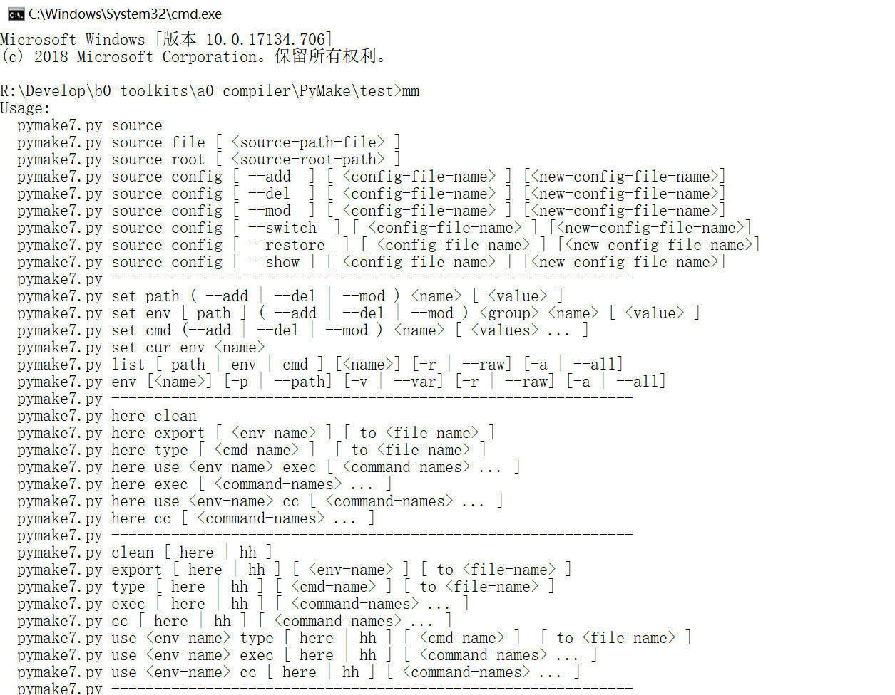

# PyMake  

- *If you'd like to make cross-platform project, but cmake can't build, it need to config running environment ?*
- *If you have issued want to depend some projects generated by cmake qmake autotools e.g but they all need to change not alike variable about environment across third platforms at least?*
- *Now pymake make beautiful, config once by use it in any platforms.*  

# Install  

PyMake: goto source directory.  

Windows:  
install.bat %*  

Unix:  
install.sh  

on console, use mm cc cmd-name to execute command stream.  

# Usage:  

## Version 1.0  
*work-store-directory>python path/to/pymake.py -h*

```shell
use source config: pymake.json
PyMake 1.0.

Usage:
  pymake.py source [ --delete | --add | --switch ] [ <config-file-name> ]
  pymake.py source [ --list | --restore ]
  pymake.py list-path [ --keys | --values ]
  pymake.py config ( --toolchain | --genmake | --make | --build ) <path>
  pymake.py other-bin ( --add | --del | --mod ) <name> [ <path> ]
  pymake.py (generate|build|install)
  pymake.py genmake <genmake-command>
  pymake.py (-h | --help)
  pymake.py --version

Command:
  source        switch to another config file
  genmake       execute genmake command after
  generate
  build
  install       pymake command
  config        config toolchain path
  list-path
  other-bin     modify the other bin path to env

Options:
  -h --help     Show this screen.
  --version     Show version.
  --add
  --del --delete
  --mod         add or delete or modify a config or path
  --switch      switch to another source
  --keys
  --values
  --toolchain   set toolchain path in source config file
  --build       set build directory in souce config file
  --genmake     set genmake directory in current souce
  --make        set make directory in current source config file
  --list        list haved source files
  --restore     reset to pymake.json source config file
```
*You can follow this tips to do configure thing. now it support cmake.*

## How to Configure  

### *From config file*  

```shell
pymake.ini

[pymake]
config = pymake.json

```
*it switch to current config file to do any make tasks*


```shell
pymake.json

{
    "add-to-env": {
        "PYMAKE_TOOLCHAIN_PATH": "C:/Users/Administrator/Qt/Tools/mingw530_32/bin", 
        "PYMAKE_GENMAKE_PATH": "Z:/abel/Develop/b0-toolskits/compliers/cmake3.9.1_64/bin",
        "PYMAKE_MAKE_PATH": "C:/Users/Administrator/Qt/Tools/mingw530_32/bin"
    }, 
    "source-to-build": {
        "PYMAKE_BUILD_PATH": "Z:/abel/Develop/a0-Developworkspace/a0-qqtpruduct-qqtfoundation/build", 
        "PYMAKE_GENMAKE_COMMAND": "cmake -G\"MinGW Makefiles\" ../", 
        "PYMAKE_MAKE_COMMAND": "mingw32-make", 
        "PYMAKE_INSTALL_COMMAND": "mingw32-make install"
    }, 
    "add-other-bin-path-to-env": {
        "qt5.9-win32": "C:/Users/Administrator/Qt/5.9.1/mingw53_32/bin"
    }
}
```
*I use json format to store the configure, it is easy to read. You can make some lot of by this file(also template) to create new building task file.*

### *From command-line*   

```shell
work-store-directory>python path/to/pymake.py ...
```

*from command-line, you can config all that path and command. program will follow configured file, chdir to build path, then execute your command to generate build install e.g. You can also execute genmake command raw from this program command-line.* 

# Version 6  
*You need install python3 (python2 is alse support, but suggest 3)*  
*You should use link to make a link mm to pymake.sh.*
*in windows, create mm.bat in windows dir call pymake.bat*  

*Firstly, you need set source root to store all of your source config file*  
*Secondly, config the source file, prepare to auto shell all your command*  

*any-direcotory>mm*

```shell
Usage:
  pymake6.py source
  pymake6.py source root [ <source-root-path> ]
  pymake6.py source config [ --add | --del | --mod | --switch | --restore | --show ] [ <config-file-name> ] [<new-config-file-name>]
  pymake6.py set path ( --add | --del | --mod ) <name> [ <value> ]
  pymake6.py set env cur <name>
  pymake6.py set env [ path ] ( --add | --del | --mod ) <group> <name> [ <value> ]
  pymake6.py set cmd (--add | --del | --mod ) <name> [ <values> ... ]
  pymake6.py export [ <name> ]
  pymake6.py list ( path | env | cmd ) [-r | --raw]
  pymake6.py k [ <name> ]
  pymake6.py (-h | --help)
  pymake6.py --version
```
*Program will make .pymake config root to config the pymake,*
*but, in windows it is set in appdata directory*

```bash
[pymake]

[source]
root = /Users/abel/Develop/c0-buildconfig
config = pymake6-mac.json
```
## Json file is Changed  
```shell
    "path-assemblage": {
        "root": "/Users/abel/Develop",
        "root.src": "${root}/a0-develop",
        "root.prod": "${root}/b1-product",
        "root.tool": "${root}/b0-toolskits",
        "root.build": "${root}/c0-buildstation",
        "root.test": "${root}/c2-test",
        "root.webrc": "${root}/c1-webrc",
        "cc": "${root.tool}/compiler",
        "cmake.bin": "${cc}/CMake.app/Contents/bin",
        "qt": "${root.tool}/macLibraries/Qt",
        "qt5.9.clang": "${qt}/5.9.1/clang_64",
        "qt5.8.android_x86": "${qt}/5.8/android_x86",
        "qt5.8.android_arm": "${qt}/5.8/android_armv7",
        "qt5.8.clang": "${qt}/5.8/clang_64",
        "qt5.8.ios": "${qt}/5.8/ios",
        "qt4.8.clang": "${qt}/4.8.7/clang_64",
        "qt5.9.clang.bin": "${qt}/5.9.1/clang_64/bin",
        "qt5.8.android_x86.bin": "${qt}/5.8/android_x86/bin",
        "qt5.8.android_arm.bin": "${qt}/5.8/android_armv7/bin",
        "qt5.8.clang.bin": "${qt}/5.8/clang_64/bin",
        "qt5.8.ios.bin": "${qt}/5.8/ios/bin",
        "qt4.8.clang.bin": "${qt}/4.8.7/clang_64/bin",
        "android": "${root.tool}/macAndroidLibraries",
        "android.sdk": "${android}/android-sdk-macosx",
        "android.ndk": "${android}/android-ndk-r13b",
        "android.ant": "${android}/apache-ant-1.10.1",
        "android.java": "${android}/java-macosx/Java/JavaVirtualMachines",
        "sdk.plat.tool": "${android.sdk}/platform-tools",
        "sdk.build.tool": "${android.sdk}/build-tools",
        "sdk.tool": "${android.sdk}/tools",
        "java1.7.home": "${android.java}/jdk1.7.0_79.jdk/Contents/Home",
        "java1.8.home": "${android.java}/jdk1.8.0_111.jdk/Contents/Home",
        "java1.9.home": "${android.java}/jdk9.jdk/Contents/Home",
        "java1.7.bin": "${java1.7.home}/bin",
        "java1.8.bin": "${java1.8.home}/bin",
        "java1.9.bin": "${java1.9.home}/bin",
        "ant.bin": "${android.ant}/bin",
        "ndk.arm": "${android.ndk}/toolchains/arm-linux-androideabi-4.9/prebuilt/darwin-x86_64",
        "ndk.x86": "${android.ndk}/toolchains/x86-4.9/prebuilt/darwin-x86_64",
        "ndk.x86_64": "${android.ndk}/toolchains/x86_64-4.9/prebuilt/darwin-x86_64",
        "ndk.arm.bin": "${ndk.arm}/bin",
        "ndk.x86.bin": "${ndk.x86}/bin",
        "ndk.x86_64.bin": "${ndk.x86_64}/bin",
        "mac.sdk": "/Applications/Xcode.app/Contents/Developer/Platforms/MacOSX.platform/Developer/SDKs/MacOSX.sdk/System/Library/Frameworks"
    },
    "environ": {
        "android.mobile": {
            "path+": [
                "${cmake.bin}",
                "${qt5.8.android_arm.bin}",
                "${java1.8.bin}",
                "${android.sdk}",
                "${sdk.plat.tool}",
                "${sdk.build.tool}",
                "${sdk.tool}",
                "${ant.bin}",
                "${ndk.arm.bin}"
            ],
            "ANDROID_API_VERSION": "android-23",
            "ANDROID_SDK_ROOT": "${android.sdk}",
            "ANDROID_NDK_ROOT": "${android.ndk}",
            "ANDROID_NDK_HOST": "darwin-x86_64",
            "ANDROID_NDK_TOOLCHAIN_PREFIX": "arm-linux-androideabi",
            "ANDROID_NDK_TOOLCHAIN_VERSION": "4.9",
            "ANDROID_NDK_PLATFORM": "android-23",
            "NDK_TOOLCHAIN_PATH": "${ndk.arm.bin}",
            "NDK_TOOLS_PREFIX": "arm-linux-androideabi",
            "PYMAKE_MYNAME": "T.D.R",
            "a_special_var_const": "hello world",
            "QKIT": "Android",
            "QTDIR": "${qt5.8.android_arm}",
            "QTSPEC": "android-g++",
            "QTCONFIG": "arm",
            "JAVA_HOME": "${java1.8.home}",
            "CLASSPATH": ".:${JAVA_HOME}/lib/dt/jar:${JAVA_HOME}/lib/tools.jar"
        },
        "android.x86": {
            "path+": [
                "${cmake.bin}",
                "${qt5.8.android_x86.bin}",
                "${java1.8.bin}",
                "${android.sdk}",
                "${sdk.plat.tool}",
                "${sdk.build.tool}",
                "${sdk.tool}",
                "${ant.bin}",
                "${ndk.x86.bin}"
            ],
            "CLICOLOR": "1",
            "ANDROID_API_VERSION": "android-23",
            "ANDROID_SDK_ROOT": "${android.sdk}",
            "ANDROID_NDK_ROOT": "${android.ndk}",
            "ANDROID_NDK_HOST": "darwin-x86_64",
            "ANDROID_NDK_TOOLCHAIN_PREFIX": "x86",
            "ANDROID_NDK_TOOLCHAIN_VERSION": "4.9",
            "ANDROID_NDK_PLATFORM": "android-23",
            "NDK_TOOLCHAIN_PATH": "${ndk.x86.bin}",
            "NDK_TOOLS_PREFIX": "i686-linux-android",
            "QKIT": "Android",
            "QTDIR": "${qt5.8.android_x86}",
            "QTSPEC": "android-g++",
            "QTCONFIG": "arm",
            "JAVA_HOME": "${java1.8.home}",
            "CLASSPATH": ".:${JAVA_HOME}/lib/dt/jar:${JAVA_HOME}/lib/tools.jar"
        },
        "qt.android": {
            "path+": [
                "${cmake.bin}",
                "${qt5.9.clang.bin}",
                "${java1.8.bin}",
                "${android.sdk}",
                "${sdk.plat.tool}",
                "${sdk.build.tool}",
                "${sdk.tool}",
                "${ant.bin}",
                "${ndk.arm.bin}"
            ],
            "ANDROID_API_VERSION": "android-23",
            "ANDROID_SDK_ROOT": "${android.sdk}",
            "ANDROID_NDK_ROOT": "${android.ndk}",
            "ANDROID_NDK_HOST": "darwin-x86_64",
            "ANDROID_NDK_TOOLCHAIN_PREFIX": "i686-linux-android",
            "ANDROID_NDK_TOOLCHAIN_VERSION": "4.9",
            "ANDROID_NDK_PLATFORM": "android-23",
            "NDK_TOOLCHAIN_PATH": "${ndk.arm.bin}",
            "NDK_TOOLS_PREFIX": "i686-linux-android",
            "QKIT": "macOS",
            "QTDIR": "${qt5.9.clang}",
            "QTSPEC": "macx-clang",
            "QTCONFIG": "x86_64",
            "JAVA_HOME": "${java1.8.home}",
            "CLASSPATH": ".:${JAVA_HOME}/lib/dt/jar:${JAVA_HOME}/lib/tools.jar"
        },
        "qt": {
            "path+": [
                "${cmake.bin}",
                "${qt5.9.clang.bin}"
            ],
            "QKIT": "macOS",
            "QTDIR": "${qt5.9.clang}",
            "QTSPEC": "macx-clang",
            "QTCONFIG": "x86_64"
        },
        "current": "qt.android"
    },
    "variable-assemblage": [
        "QQt",
        "a0-qqtfoundation",
        "${root.build}/${qqt.proj.name}/${qt.sys.mac}/${build.release}",
        "${root.src}/${qqt.proj.name}",
        "${qqt.proj.name}.pro",
        "${qqt.build.path}/src/bin",
        "${root.prod}/QQt",
        "qqtframe",
        "${qqt.build.path}/examples/${qqtframe.prod.name}/bin",
        "${qqt.build.path}/src/bin/QQt.framework",
        "QQt.framework/Versions/1/QQt",
        "${root.tool}/Source/qt5",
        "${root.build}/qt5",
        "androiddeployqt",
        "macdeployqt",
        "DownloadQueue",
        "/Users/abel/Develop/c1-webrc/DownloadQueue/DownloadQueue.pro",
        "${root.build}/${app.name}",
        "macdeployqt ${app.path.build}/${app.name}.app",
        "${prod.name}.app",
        "${mac.app}/Contents",
        "${mac.app.content}/MacOS",
        "${mac.app.content}/Frameworks",
        "${mac.app.content}/Resources",
        "${mac.app.content}/PlugIns",
        "${prod.name}.framework",
        "${prod.name}.framework/Versions",
        "${prod.name}.framework/Resources",
        "macdeployqt ${}"
    ],
    "command-assemblage": [
        "I'm not similar to these command, so list them here, rather than forgotten them",
        "cl-command, sys-command",
        "replace? no, append? easy!",
        "help you to remeber these command.",
        "mkdir -p ${qqt.build.path}",
        "cd ${build-path}",
        "cmake -G\"Unix Makefiles\" -DCMAKE_INSTALL_PREFIX=${prod-root} ${source-path}",
        "cmake -GXCode -DCMAKE_INSTALL_PREFIX=${prod-root} ${source-path}",
        "rm -f CMakeCache.txt",
        "qmake ${source-path}/${qmake-file} -spec ${QTSPEC} CONFIG+=${QTCONFIG} && make qmake_all",
        "make -j4",
        "make clean in ${build-path}",
        "make install",
        "${deployqt} ${bin-path}/${app-bundle} -verbose=1",
        "${deployqt} -dmg",
        "${deployqt} --help",
        "cp -fr ${lib-dep} ${lib-native}",
        "install_name_tool -change ${lib-dep-name} @rpath/${lib-dep-name} ${app-native}/${prod-name} ",
        "install_name_tool -change $LibDep @rpath/$LibDep ${app-native}/${prod-name} ",
        "${source-path}/configure -prefix ${install-path} -hostprefix ${install-path} -xplatform android-g++ -release -nomake tests -nomake examples -android-ndk $ANDROID_NDK_ROOT -android-sdk $ANDROID_SDK_ROOT -android-ndk-host $ANDROID_NDK_HOST -android-toolchain-version $ANDROID_NDK_TOOLCHAIN_VERSION -skip qtwebkit-examples -no-warnings-are-errors",
        "${qt5.path.source}/configure -prefix ${qt5.path.install} -hostprefix ${qt5.path.install} -xplatform android-g++ -release -nomake tests -nomake examples -android-ndk $ANDROID_NDK_ROOT -android-sdk $ANDROID_SDK_ROOT -android-ndk-host $ANDROID_NDK_HOST -android-toolchain-version $ANDROID_NDK_TOOLCHAIN_VERSION -skip qtwebkit-examples -no-warnings-are-errors"
    ],
    "command": {
        "qqt.build": [
            "src=/Users/abel/Develop/a0-develop/a0-qqtfoundation/a0-qqtfoundation.pro",
            "build=/Users/abel/Develop/c0-buildstation/a0-qqtfoundation/MacOS/Release",
            "mkdir -p $build",
            "cd $build",
            "qmake $src -spec ${QTSPEC} CONFIG+=${QTCONFIG} && make qmake_all",
            "make -j4"
        ],
        "qt": [
            "cd ${root.build}",
            "open \"/Applications/Qt Creator.app\""
        ],
        "android": [
            "/Users/abel/Develop/b0-toolskits/macAndroidLibraries/android-sdk-macosx/tools/android"
        ]
    }

```
*You need config path-esseblage, and environ, command. Others are stored for memeory*
*You can follow example.sh in bash file use this pymake, and you can follow example2.sh in command-line use this program*

# Version 6.2  
Only update the command-line.  
  

# Version 7.0  
Update the command-line.  
  

## Screen shot  
  

# Version 7.2  

Update the command-line.  
1. add lots of abb-command, about hh command.  
2. update use command to use custom env to do everything.
3. add see command.
2. add have/has command.  
2. add program command.  
3. add get command.
4. add port and translate command.
5. add initialize command.
6. add port/translate command.  
3. add user support shell.    

   
   
   

# Version 7.4  
1. custom path and env variable, common to use.
1. spread all over pc script.  
2. any work root.
3. high-quality executing ability.
4. appoint environ.  
5. abundant command in environ .json stored.
5. **all are in user environment source root.**

# Version 7.5  
1. add powershell command.
    - all .json environ can be used in powershell environment.
2. add custom environment.
    - user can store temporary or common path and variable in custom.path+.ini or custom.var+.ini.  
    - these environment can be used in powershell environment.
    - you can open custom mobule or close it.

## Command-line  

```shell
Microsoft Windows [版本 10.0.17134.706]
(c) 2018 Microsoft Corporation。保留所有权利。

R:\Develop\b0-toolkits\a0-compiler\PyMake>pymake -h
PyMake 7.5.5.

Usage:
  pymake7.py  source
  pymake7.py  source file [ <source-path-file> ]
  pymake7.py  source root [ <source-root-path> ]
  pymake7.py  source config [ --add  ] [ <config-file-name> ]
  pymake7.py  source config [ --del  ] [ <config-file-name> ]
  pymake7.py  source config [ --mod  ] [ <config-file-name> ] [<new-config-file-name>]
  pymake7.py  source config [ --switch  ] [ <config-file-name> ]
  pymake7.py  source config [ --edit  ] [ <config-file-name> ]
  pymake7.py  source config [ --restore  ]
  pymake7.py  source config [ --show ]
  pymake7.py  -------------------------------------------------------------
  pymake7.py  set path ( --add | --del | --mod ) <name> [ <value> ]
  pymake7.py  set env [ path ] ( --add | --del | --mod ) <group> <name> [ <value> ]
  pymake7.py  set cmd (--add | --del | --mod ) <name> [ <values> ... ]
  pymake7.py  set cur env <name>
  pymake7.py  list [ path | env | cmd ] [<name>] [-r | --raw] [-a | --all]
  pymake7.py  env [<name>] [-p | --path] [-v | --var] [-r | --raw] [-a | --all]
  pymake7.py  -------------------------------------------------------------
  pymake7.py  here clean
  pymake7.py  here export [ <env-name> ] [ to <file-name> ]
  pymake7.py  here type [ <cmd-name> ]  [ to <file-name> ]
  pymake7.py  here use <env-name> exec [ <command-names> ... ]
  pymake7.py  here exec [ <command-names> ... ]
  pymake7.py  here use <env-name> cc [ <command-names> ... ]
  pymake7.py  here cc [ <command-names> ... ]
  pymake7.py  -------------------------------------------------------------
  pymake7.py  clean [ here | hh ]
  pymake7.py  export [ here | hh ] [ <env-name> ] [ to <file-name> ]
  pymake7.py  type [ here | hh ] [ <cmd-name> ] [ to <file-name> ]
  pymake7.py  exec [ here | hh ] [ <command-names> ... ]
  pymake7.py  cc [ here | hh ] [ <command-names> ... ]
  pymake7.py  use <env-name> type [ here | hh ] [ <cmd-name> ]  [ to <file-name> ]
  pymake7.py  use <env-name> exec [ here | hh ] [ <command-names> ... ]
  pymake7.py  use <env-name> cc [ here | hh ] [ <command-names> ... ]
  pymake7.py  -------------------------------------------------------------
  pymake7.py  set current env <name>
  pymake7.py  set default env <name>
  pymake7.py  show [ path | env | cmd ] [<name>] [-r | --raw] [-a | --all]
  pymake7.py  environ [<name>] [-p | --path] [-v | --var] [-r | --raw] [-a | --all]
  pymake7.py  see [ <cmd-name> ] [ use <env-name> ] [-r | --raw] [-a | --all] [ -l | --linenumber ]
  pymake7.py  ss [ <cmd-name> ] [ use <env-name> ] [-r | --raw] [-a | --all] [ -l | --linenumber ]
  pymake7.py  cmd [ <cmd-name> ] [ use <env-name> ] [-r | --raw] [-a | --all] [ -l | --linenumber ]
  pymake7.py  use <env-name> see [ <cmd-name> ] [-r | --raw] [-a | --all] [ -l | --linenumber ]
  pymake7.py  use <env-name> ss [ <cmd-name> ] [-r | --raw] [-a | --all] [ -l | --linenumber ]
  pymake7.py  use <env-name> cmd [ <cmd-name> ] [-r | --raw] [-a | --all] [ -l | --linenumber ]
  pymake7.py  -------------------------------------------------------------
  pymake7.py  hh clean
  pymake7.py  hh export [ <env-name> ] [ to <file-name> ]
  pymake7.py  hh type [ <cmd-name> ]  [ to <file-name> ]
  pymake7.py  hh use <env-name> exec [ <command-names> ... ]
  pymake7.py  hh exec [ <command-names> ... ]
  pymake7.py  hh use <env-name> cc [ <command-names> ... ]
  pymake7.py  hh cc [ <command-names> ... ]
  pymake7.py  -------------------------------------------------------------
  pymake7.py  have path <name> [-r | --raw]
  pymake7.py  have env [ path ] [ <group> ] [ <name> ] [-r | --raw]
  pymake7.py  have cmd <name> [-r | --raw]
  pymake7.py  has path <name> [-r | --raw]
  pymake7.py  has env [ path ] [ <group> ] [ <name> ] [-r | --raw]
  pymake7.py  has cmd <name> [-r | --raw]
  pymake7.py  -------------------------------------------------------------
  pymake7.py  get cur env
  pymake7.py  get current env
  pymake7.py  get default env
  pymake7.py  get env
  pymake7.py  get env ( cur | current | default )
  pymake7.py  -------------------------------------------------------------
  pymake7.py  program
  pymake7.py  program root
  pymake7.py  program file
  pymake7.py  program configure
  pymake7.py  program configure root
  pymake7.py  program configure file
  pymake7.py  get all
  pymake7.py  get all ( info | information )
  pymake7.py  get all ( stat | status )
  pymake7.py  get all settings [ path | env | cmd ] [<name>] [-r | --raw] [-a | --all]
  pymake7.py  get default exec root
  pymake7.py  get exec root [ default | here ]
  pymake7.py  initialize
  pymake7.py  -------------------------------------------------------------
  pymake7.py  port
  pymake7.py  port root [ <source-config-root> ] [ to <target-config-root> ]
  pymake7.py  port config [ <source-config-file> ] [ to <target-config-file> ]
  pymake7.py  port file [ <source-path-file> ] [ to <target-path-file> ]
  pymake7.py  port root ( --source | --target ) <config-root>
  pymake7.py  port config ( --source | --target ) <config-file>
  pymake7.py  port file ( --source | --target ) <path-file>
  pymake7.py  port reset
  pymake7.py  translate
  pymake7.py  translate ( path | env | cmd )
  pymake7.py  translate ( path | env | cmd ) <key-name> [ to <target-key-name> ] [ -f | --force ]
  pymake7.py  translate ( path | env | cmd ) [ -a | --all ] [ -f | --force ]
  pymake7.py  translate path-env-cmd [ -a | --all ] [ -f | --force ]
  pymake7.py  translate all [ -a | --all ] [ -f | --force ]
  pymake7.py  translate section
  pymake7.py  translate section <section-name> [ to <target-section-name> ] [ -f | --force ]
  pymake7.py  translate section [ -a | --all ] [ -f | --force ]
  pymake7.py  -------------------------------------------------------------
  pymake7.py  exec-with-params [ here | hh ] [ <command-name> ] [ --params=<command-params> ... ] [ --workroot=<work-root-path> ]
  pymake7.py  use <env-name> exec-with-params [ here | hh ] [ <command-name> ] [ --params=<command-params> ... ] [ --workroot=<work-root-path> ]
  pymake7.py  here exec-with-params [ <command-name> ] [ --params=<command-params> ... ] [ --workroot=<work-root-path> ]
  pymake7.py  here use <env-name> exec-with-params [ <command-name> ] [ --params=<command-params> ... ] [ --workroot=<work-root-path> ]
  pymake7.py  hh exec-with-params [ <command-name> ] [ --params=<command-params> ... ] [ --workroot=<work-root-path> ]
  pymake7.py  hh use <env-name> exec-with-params [ <command-name> ] [ --params=<command-params> ... ] [ --workroot=<work-root-path> ]
  pymake7.py  -------------------------------------------------------------
  pymake7.py  execvp [ here | hh ] [ <command-name> ] [ <command-params> ... ]
  pymake7.py  use <env-name> execvp [ here | hh ] [ <command-name> ] [ <command-params> ... ]
  pymake7.py  here execvp [ <command-name> ] [ <command-params> ... ]
  pymake7.py  here use <env-name> ccvp [ <command-name> ] [ <command-params> ... ]
  pymake7.py  hh ccvp [ <command-name> ] [ <command-params> ... ]
  pymake7.py  hh use <env-name> ccvp [ <command-name> ] [ <command-params> ... ]
  pymake7.py  -------------------------------------------------------------
  pymake7.py  ccvp [ here | hh ] [ <command-name> ] [ <command-params> ... ]
  pymake7.py  use <env-name> ccvp [ here | hh ] [ <command-name> ] [ <command-params> ... ]
  pymake7.py  here ccvp [ <command-name> ] [ <command-params> ... ]
  pymake7.py  here use <env-name> execvp [ <command-name> ] [ <command-params> ... ]
  pymake7.py  hh execvp [ <command-name> ] [ <command-params> ... ]
  pymake7.py  hh use <env-name> execvp [ <command-name> ] [ <command-params> ... ]
  pymake7.py  -------------------------------------------------------------
  pymake7.py  import cmd [ hh | here ] [ <script-file> ] [ -a | --all ] [ -f | --force ] [ --recursive ] [ --encoding=<encoding-name> ] [ --filter=<name-filter> ... ]
  pymake7.py  here import cmd [ <script-file> ] [ -a | --all ] [ -f | --force ] [ --recursive ] [ --encoding=<encoding-name> ] [ --filter=<name-filter> ... ]
  pymake7.py  hh import cmd [ <script-file> ] [ -a | --all ] [ -f | --force ] [ --recursive ] [ --encoding=<encoding-name> ] [ --filter=<name-filter> ... ]
  pymake7.py  -------------------------------------------------------------
  pymake7.py  backup [ here | hh ] [ <zip-file-name> ]
  pymake7.py  here backup [ <zip-file-name> ]
  pymake7.py  hh backup [ <zip-file-name> ]
  pymake7.py  recovery [ here | hh ] [ <zip-file-name> ]
  pymake7.py  here recovery [ <zip-file-name> ]
  pymake7.py  hh recovery [ <zip-file-name> ]
  pymake7.py  -------------------------------------------------------------
  pymake7.py  system
  pymake7.py  system [ stat | status ]
  pymake7.py  system [ info | information ]
  pymake7.py  system path [ --add | --del ] [ <value> ]
  pymake7.py  system var [ --add | --del ] [ <key> ] [ <value> ]
  pymake7.py  system env [ -r | --raw ]
  pymake7.py  -------------------------------------------------------------
  pymeke7.py  custom
  pymake7.py  custom [ open | close ]
  pymake7.py  custom [ stat | status ]
  pymake7.py  custom [ info | information ]
  pymake7.py  custom path [ --add | --del ] [ <value> ]
  pymake7.py  custom var [ --add | --del ] [ <key> ] [ <value> ]
  pymake7.py  custom env [ -r | --raw ]
  pymake7.py  custom export [ here | hh ] [ to <file-name> ]
  pymake7.py  custom exec-with-params [ here | hh ] [ <command-name> ] [ --params=<command-params> ... ] [ --workroot=<work-root-path> ]
  pymake7.py  custom use <env-name> exec-with-params [ here | hh ] [ <command-name> ] [ --params=<command-params> ... ] [ --workroot=<work-root-path> ]
  pymake7.py  export2 [ powershell ] [ here | hh ] [ <env-name> ] [ to <file-name> ] [ -c | --custom ] [ -s | --system ]
  pymake7.py  -------------------------------------------------------------
  pymake7.py  powershell
  pymake7.py  powershell [ info | information ]
  pymake7.py  powershell [ stat | status ]
  pymake7.py  powershell clean [ here | hh ]
  pymake7.py  powershell export [ here | hh ] [ <env-name> ] [ to <file-name> ]
  pymake7.py  powershell type [ here | hh ] [ <cmd-name> ] [ to <file-name> ]
  pymake7.py  powershell use <env-name> type [ here | hh ] [ <cmd-name> ]  [ to <file-name> ]
  pymake7.py  powershell exec-with-params [ here | hh ] [ <command-name> ] [ --params=<command-params> ... ] [ --workroot=<work-root-path> ]
  pymake7.py  powershell use <env-name> exec-with-params [ here | hh ] [ <command-name> ] [ --params=<command-params> ... ] [ --workroot=<work-root-path> ]
  pymake7.py  -------------------------------------------------------------
  pymake7.py  python
  pymake7.py  python [ info | information ]
  pymake7.py  python [ stat | status ]
  pymake7.py  python clean [ here | hh ]
  pymake7.py  python type [ here | hh ] [ <cmd-name> ] [ to <file-name> ]
  pymake7.py  python use <env-name> type [ here | hh ] [ <cmd-name> ]  [ to <file-name> ]
  pymake7.py  python exec-with-params [ here | hh ] [ <command-name> ] [ --params=<command-params> ... ] [ --workroot=<work-root-path> ]
  pymake7.py  python use <env-name> exec-with-params [ here | hh ] [ <command-name> ] [ --params=<command-params> ... ] [ --workroot=<work-root-path> ]
  pymake7.py  -------------------------------------------------------------
  pymake7.py  (-h | --help)
  pymake7.py  --version

Command:
  source            switch to another source file
  source root       config root directory
  source config     config source conf file
  set path          path assemblage
  set env           set env variable
  set cmd           set cmd stream
  export            output private env variable and paths to a bat file or sh file [default:current, env]
  type              output command to a bat file or sh file [default:cmd]
  see               check command stream
  ss                check command stream
  cmd               check command stream
  list              list config values, show command also too.
  set cur env       set default env, set current env.
  use               use selected env exec commands
  here              at here do exec commands e.g.
  hh                at here do exec commands e.g.
  exec              exec commands list.
  cc                exec commands list.
  have              check env or path or cmd item whether user has configured.
  has               check env or path or cmd item whether user has configured.
  clean             clean *_effect.sh *_unset.sh *_exec.sh, or .bat.
  program           pymake.py program information.
  get               lots of important information about pymake.py.
  initialize        if program crashed, user can use this command to reset.
  port              port from source to target .json file, configure source root and config file.
  translate         translate section from source to target, and other section.
  exec-with-params  exec a command with params, it is also execvp and ccvp.
  backup            backup all env .json to a zip file.
  recovery          recovery all env .json from a zip file.
  import            import user path or env or cmd to env .json file. example, import cmd [ <script-file>: x.bat x.cmd x.sh x.ps1 ... ]
  custom            custom environment is helpping for calling large dimentions of scripts in computer, manually in console. defined in sourceroot. [ default: close ]
  export2           output private environ and custom environ to a bat file or sh file, a powerfull function from export, support powershell also. [default:current, env]
  powershell        environ for powershell, and to execute in powershell. [cross]
  python            list python information, and execute python script.

Options:
  -h --help     Show this screen.
  --version     Show version.
  --add
  --del
  --mod         add or delete or modify a config or path
  --switch      switch to another source
  --show        display source config files
  --restore     reset to source config file pymake.json.
  -r, --raw     expand editing config values

  --encoding=<encoding-name>    script file encoding, support utf8, gbk, ansi, ... and so on. [default:utf8]
  --filter=<name-filter> ...    filter file name postfix, separated by |. example: .bat | .sh | .ps1.

R:\Develop\b0-toolkits\a0-compiler\PyMake>
```


## Environment    

```shell

Microsoft Windows [版本 10.0.17134.706]
(c) 2018 Microsoft Corporation。保留所有权利。

R:\Develop\b0-toolkits\a0-compiler\PyMake>pymake system
system env
path+:
  C:\WINDOWS\system32
  C:\WINDOWS
  C:\WINDOWS\System32\Wbem
  C:\WINDOWS\System32\WindowsPowerShell\v1.0\
  C:\Program Files (x86)\NVIDIA Corporation\PhysX\Common
  C:\Program Files\TortoiseGit\bin
  C:\WINDOWS\system32
  C:\WINDOWS
  C:\WINDOWS\System32\Wbem
  C:\WINDOWS\System32\WindowsPowerShell\v1.0\
  C:\WINDOWS\System32\OpenSSH\
  C:\Program Files\Microsoft Network Monitor 3\
  D:\HsuHelper\TZWebPdf
  D:\HsuHelper\TZKey
  C:\Program Files\Git\cmd
  C:\Users\Administrator\AppData\Local\Microsoft\WindowsApps
variable:
  ALLUSERSPROFILE                C:\ProgramData
  APPDATA                        C:\Users\Administrator\AppData\Roaming
  COMMONPROGRAMFILES             C:\Program Files\Common Files
  COMMONPROGRAMFILES(X86)        C:\Program Files (x86)\Common Files
  COMMONPROGRAMW6432             C:\Program Files\Common Files
  COMPUTERNAME                   SC-201803271727
  COMSPEC                        C:\WINDOWS\system32\cmd.exe
  DRIVERDATA                     C:\Windows\System32\Drivers\DriverData
  FILEPATH                       R:\Develop\b0-toolkits\a0-compiler\PyMake\
  FPS_BROWSER_APP_PROFILE_STRING Internet Explorer
  FPS_BROWSER_USER_PROFILE_STRING Default
  HOMEDRIVE                      C:
  HOMEPATH                       \Users\Administrator
  LOCALAPPDATA                   C:\Users\Administrator\AppData\Local
  LOGONSERVER                    \\SC-201803271727
  NUMBER_OF_PROCESSORS           20
  ONEDRIVE                       C:\Users\Administrator\OneDrive
  OS                             Windows_NT
  PATHEXT                        .COM;.EXE;.BAT;.CMD;.VBS;.VBE;.JS;.JSE;.WSF;.WSH;.MSC
  PROCESSOR_ARCHITECTURE         AMD64
  PROCESSOR_IDENTIFIER           Intel64 Family 6 Model 62 Stepping 4, GenuineIntel
  PROCESSOR_LEVEL                6
  PROCESSOR_REVISION             3e04
  PROGRAMDATA                    C:\ProgramData
  PROGRAMFILES                   C:\Program Files
  PROGRAMFILES(X86)              C:\Program Files (x86)
  PROGRAMW6432                   C:\Program Files
  PROMPT                         $P$G
  PSMODULEPATH                   C:\Program Files\WindowsPowerShell\Modules;C:\WINDOWS\system32\WindowsPowerShell\v1.0\Modules
  PUBLIC                         C:\Users\Public
  SESSIONNAME                    Console
  SYSTEMDRIVE                    C:
  SYSTEMROOT                     C:\WINDOWS
  TEMP                           C:\Users\ADMINI~1\AppData\Local\Temp
  TMP                            C:\Users\ADMINI~1\AppData\Local\Temp
  USERDOMAIN                     SC-201803271727
  USERDOMAIN_ROAMINGPROFILE      SC-201803271727
  USERNAME                       Administrator
  USERPROFILE                    C:\Users\Administrator
  WINDIR                         C:\WINDOWS

R:\Develop\b0-toolkits\a0-compiler\PyMake>pymake custom
custom env: opened.
path+:
  R:\Develop\b0-toolkits\a0-compiler\PyMake\UserSource\UserShell
  R:\Develop\b0-toolkits\a0-compiler\PyMake\UserSource
  C:\Users\Administrator\Desktop\ENVCONFIG\UserShell
  C:\Users\Administrator\Desktop\ENVCONFIG
  R:/Develop/a0-develop
  R:/Develop/e0-tools/doxygen/bin
  R:/Develop/e0-tools/doxygen/graphviz-2.38/bin
  R:/Develop/b0-toolkits/winCompilers/cmake3.9.1_64/bin
  R:/Develop/b0-toolkits/winCompilers/perl_5.26.0.1_64/perl/bin
  R:/Develop/b0-toolkits/winCompilers/xmake
  R:/Develop/b0-toolkits/winCompilers/watcom1.9/binw;R:/Develop/b0-toolkits/winCompilers/watcom1.9/binnt
  R:/Develop/b0-toolkits/a0-compiler/PyMake
  R:/Develop/b0-toolkits/a0-compiler/PyMake/demo
  R:/Develop/b0-toolkits/a0-compiler/PyMake/test
  R:/Develop/b0-toolkits/a0-compiler/PyMake/test/带 空格路径
  R:/Develop/b0-toolkits/a0-compiler/PyMake/UserSource/带 空格
  R:\一个中文路径
  R:/Develop/b0-toolkits/winCompilers/ninja
variable:
  PYMAKEAUTHOR                   T.D.R.
  PYMMXXX                        一个中文变量
  WATCOM                         R:/Develop/b0-toolkits/winCompilers/watcom1.9
  EDPATH                         R:/Develop/b0-toolkits/winCompilers/watcom1.9/eddat
  WHTMLHELP                      R:/Develop/b0-toolkits/winCompilers/watcom1.9/binnt/help
  WIPFC                          R:/Develop/b0-toolkits/winCompilers/watcom1.9/wipfc
  INCLUDE                        R:/Develop/b0-toolkits/winCompilers/watcom1.9/h;R:/Develop/b0-toolkits/winCompilers/watcom1.9/h/nt;R:/Develop/b0-toolkits/winCompilers/watcom1.9/h/nt/directx;R:/Develop/b0-toolkits/winCompilers/watcom1.9/h/nt/ddk

R:\Develop\b0-toolkits\a0-compiler\PyMake>pymake env current -r
env qt5
path+:
  R:/Develop/b0-toolkits/winCompilers/cmake3.9.1_64/bin
  R:/Develop/b0-toolkits/winLibraries/Qt/Tools/mingw530_32/bin
  R:/Develop/b0-toolkits/winLibraries/Qt/5.9.2/mingw53_32/bin
  R:/一个中文路径
variable:
  make0                          mingw32-make -j10
  QTVERSION                      5.9.2
  QTDIR                          R:/Develop/b0-toolkits/winLibraries/Qt/5.9.2/mingw53_32
  QTSPEC                         -spec win32-g++
  QTCONFIG
  QKIT                           WIN32
  QSYS                           Windows
  QBBE                           一个中文变量

R:\Develop\b0-toolkits\a0-compiler\PyMake>

```

# User Support   
User support shell module, user can install them to share their functions.   

|Program|Shortcut|Shortcut(Level 2)|
|----|----|----|  
| pymake.py | pymake | mm, pymm |
| pymake.py | pyenv | pyvc |
| pymake.py | pycmd | |
| pymake.py | pyexecvp | pyccvp |
| pymake.py | pytype |  |
| pymake.py | pyclean |  |
| pymake.py | pylanguage |  |
| pymake.py | pypowershell.bat |  |
| pymake.py | pyenv.ps1 |  |
| pyinfo.py | pyinfo || 
| pypaths.py | pypaths || 
| pycodec.py | | |
| ... |  | install,uninstall |  

[Detailed information](./SHELL.md)  


# Command  
[PyMake Command](./COMMAND.md)  


# Language       
[PyMake Language](./LANGUAGE.md)  
[PyMake Language Example](./example/pymake7-win-msvc3.json)    


# Encoding  
[PyMake Profile Encoding](./ENCODING.md)   


# Dependencies  

*This program edited by python, support python 2.7 -> 3.6 (tested).You need install python, only python in path, configured.*    
*PyMake v7 uses file encoding params in open(), then it support python3 only, I suggest you install python 3.7.*    
*At last, it will work itself, I wish you would like it.*  

