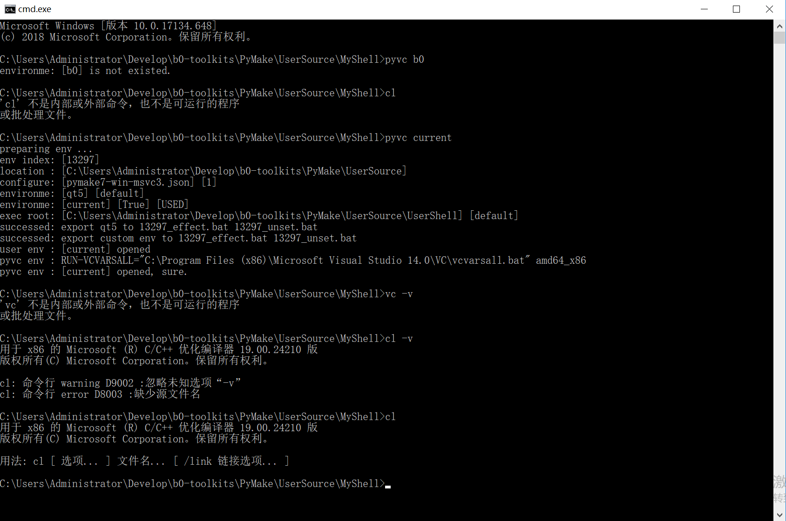
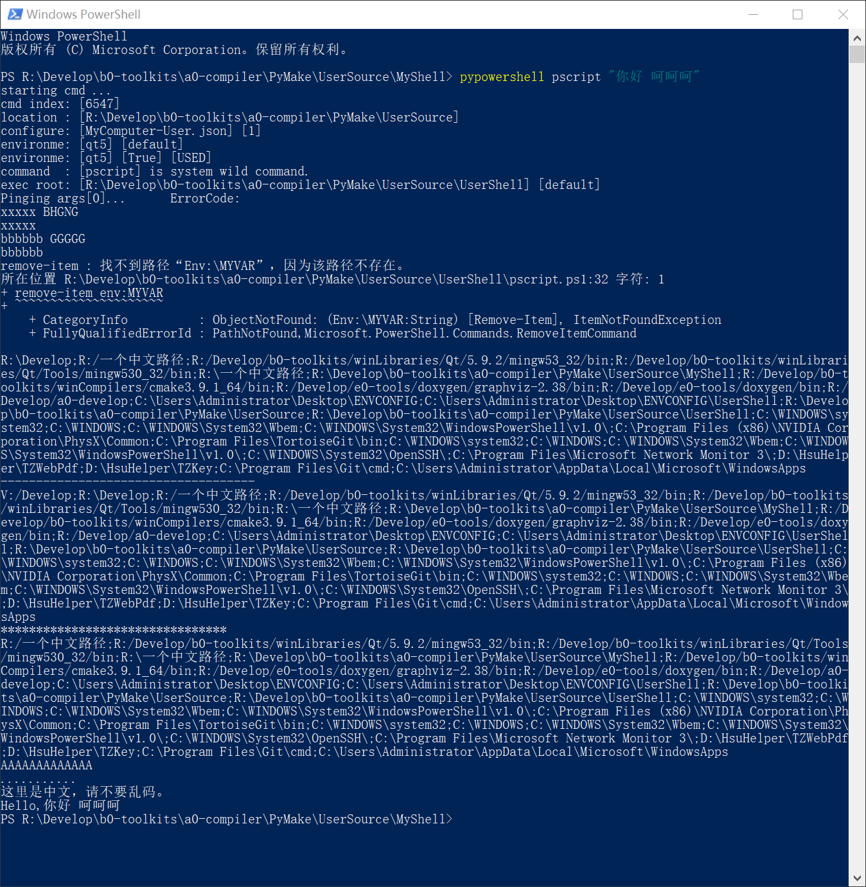
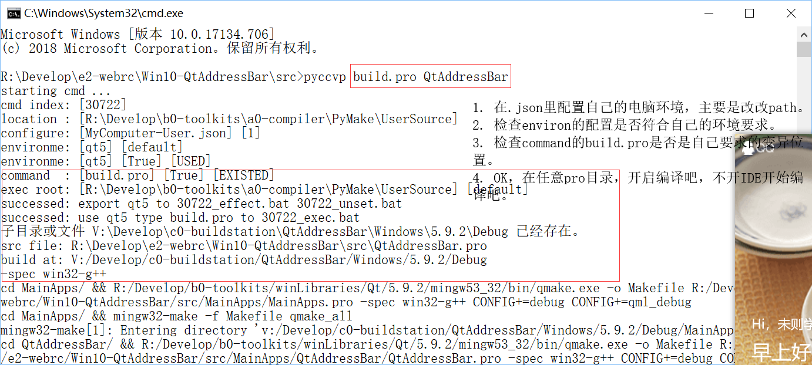
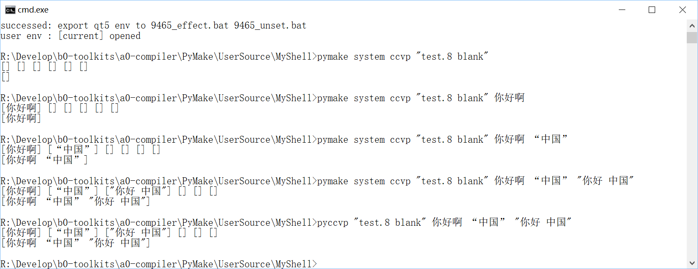
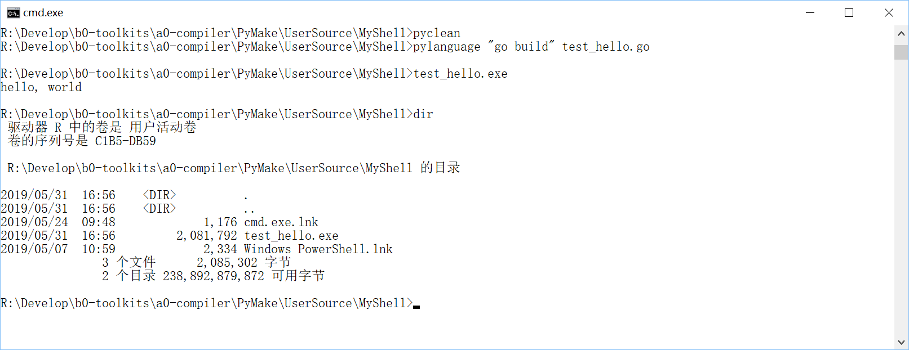
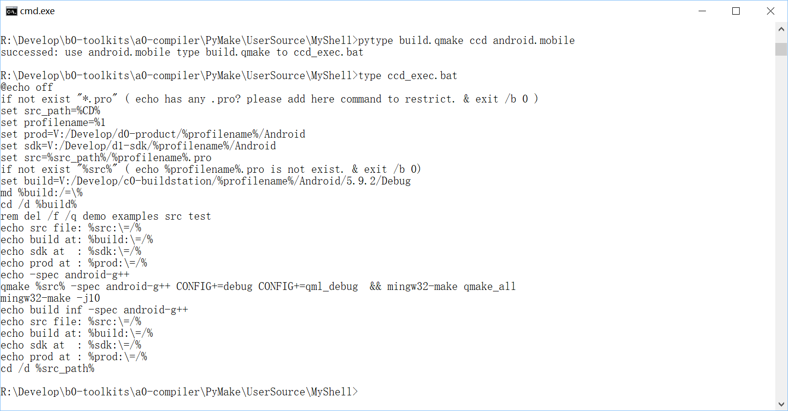

# User Support  
User support shell module, user can install them to share their functions.   

# 使用说明  
|影响当前执行器 [PyMake并行]| 不影响当前执行器 [PyMake串行]| 备注 |
|-----|-----|-----|  
|pyenv qt5| pymake set cur env qt5|||
|pytype test.3 bbc qt5| pytype test.2 abc |||
|bbc_exec.bat| abc_exec.bat|都能执行PyMake保存的命令|||
|java -v|pypowershell xxx ... ||||
| |pylanguage xxx ...||
| |pycmd test.4|||
| |pyexecvp test.5 ...|||||
| |pyccvp test.5 ...||||||
|set | pyccvp set|都能执行系统路径里的命令||||
|php xxx ... | pyccvp php xxx ... |都能执行自定路径里的命令||||
|pyenv close qt5| | |
|pyvc msvc2015| pymake set cur env msvc2015 | 都能开启新环境执行命令|
|MSBuild.exe ... | pymake vc ccvp MSBuild ... | |
|CL.exe ... | pyvcccvp CL ... | |
|pyvc close msvc2015| | |
|pyclean | pyclean| 清理掉从PyMake导出的命令 |

说明：前者，一直影响当前环境，后者，一直没影响当前环境。    
说明：前者，难度较大，后者，比较容易理解和使用。  
说明：前者和后者，不要混淆使用。  

# pyenv   

pymake可以帮助用户配置并保存多变的环境变量和路径，甚至可以保存命令。用户可以随时切换环境，编写的shell中也可以随时切换环境，代码简单。  
pymake能够给用户提供一个不会干扰系统环境、并且互不干扰的环境，还随处可以调用！这是一个创举。  

在pymake的基础上，我制作了pyenv。    
pyenv在被安装后也可以随处运行，他的特点在于，用户可以在命令行里随意开关（即更换）自有的环境。    
pyenv为用户提供了影响当前运行器的环境！这又是一个创举。      

#### pyenv 使用截图  
  
  
  
  

# pyvc  

pyvc为用户设置VC环境提供便利。  
用户在自己的环境集.json里面使用MSVC的环境配置两个变量 VCVARSALL 和 VCVARSALLPARAM 就可以使用。

#### pyvc 的使用条件  
1. 注意  
在<source-root>/<source-file>.json，即$(mm source)文件里面添加，  
在每个使用MSVC的ENV配置里必须加入两个环境变量，  
"VCVARSALL"="${vcvarsall-201x}"，${vcvarsall-201x} 路径集保存到 path-assemblage。    
"VCVARSALLPARAM"="amd64_x86"，这个环境变量根据ENV的目标决定。     
只有这样，pyvc.bat 才能执行有效。   

2. 注意  
bat环境变量不区分大小写。  
允许增加"RUN-VCVARSALL"="\"${VCVARSALL}\" ${VCVARSALLPARAM}"。  
用户自行决定配置"CLS-VCVARSALL"和"CLS-VCVARSALLPARAM"。  

#### pyvc 使用注意    
1. 这里说一下，vcvarsall.bat 是一种更换环境后全覆盖式的，其实没有清理。
但是，pyvc支持清理，环境变量 CLS-VCVARSALL 就是清理命令，CLS-VCVARSALLPARAM 是参数。
用户配置到环境集.json相应ENV中即可。也是两个环境变量。
当然，用户自行决定从何处获取清理VC环境的.bat。  
一般不需要。   
2. 环境变量 VCVARSALL VCVARSALLPARAM 已经被使用者设置进入确定的ENV，随时跟着ENV改变。  

#### pyvc 使用截图  
  

# pypowershell  

pypowershell允许用户在PyMake提供的多个环境里，使用powershell执行命令。  
pypowershell提供pypowershell.bat，用户既可以使用CMD执行器，也可以使用powershell执行器。  
pypowershell还提供pypowershell.sh，可以跨平台使用。      
用户可以在一个目录里调用任何目录下的.ps1，而且，当作命令来调用，支持输入参数，支持任意工作目录。  
支持powershell，是个开创性动作。   

  

# pyenv [.ps1]  

pypowershell允许用户在CMD、POWERSHELL等环境里执行powershell命令，但是，pypowershell执行时不会影响当前执行器的环境。  

pyenv提供三个Shortcut来影响当前执行器的环境，  
pyenv.bat来影响CMD执行器的环境，  
pyenv.sh来影响SHELL执行器的环境，  
pyenv.ps1就是来影响powershell执行器的环境的，能够跨平台使用。  

#### pyenv [.ps1] 使用截图  
  

# pyccvp  

pyccvp是对pymake exec-with-params的快捷方式，允许执行pymake内部命令或者外部命令，并且携带参数。  
和pyccvp相近的快捷方式，还有pyexecvp，pylanguage，pypowershell，pycmd。  
pycmd不能带参数。  
pylanguage支持lua、php等其他脚本语言的脚本和命令执行，并且允许携带参数。  
pypowershell运行执行powershell脚本和命令，并且是在powershell环境里。  
这几个命令都不会影响当前执行器环境。  
这几个命令都允许执行带空格的脚本名。  

#### pyccvp使用截图  
将所有的、任意的路径下的.bat，在当前路径下执行。不带路径调用。  

# pylanguage  

pylanguage允许用户执行用户路径里添加的任意路径下的脚本。支持任何脚本语言。允许带参数。  

#### pylanguage使用截图  
  

# pytype

pytype帮助用户把PyMake保存的命令导出到本地。  

#### pytype使用截图  
  

# pyclean 
pyclean将pytype导出的命令清理掉。pyclean清理当前目录中从PyMake导出的命令。  

