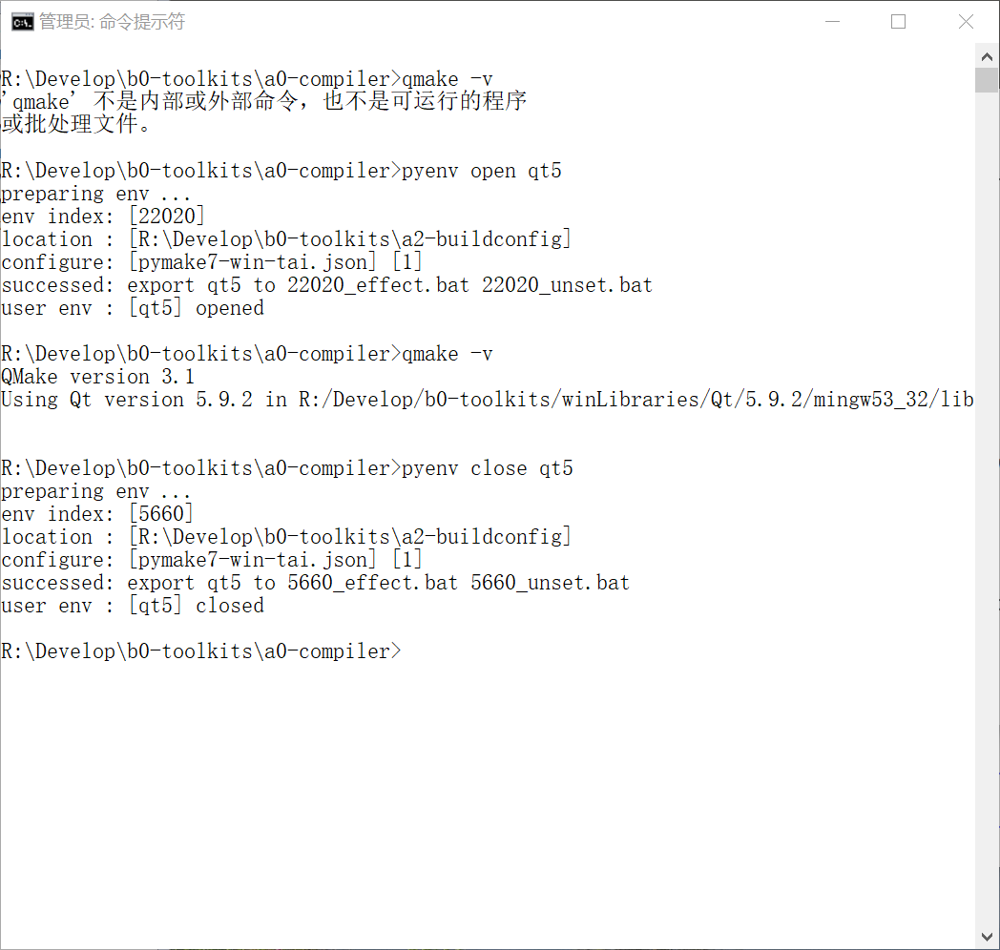
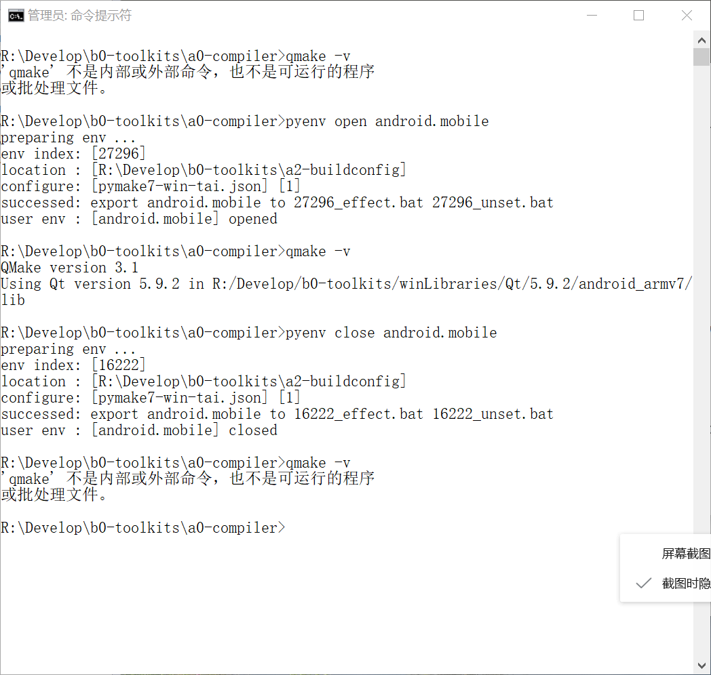
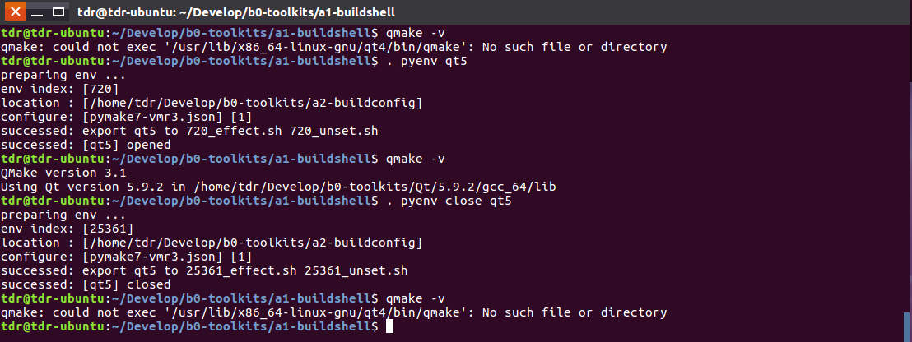
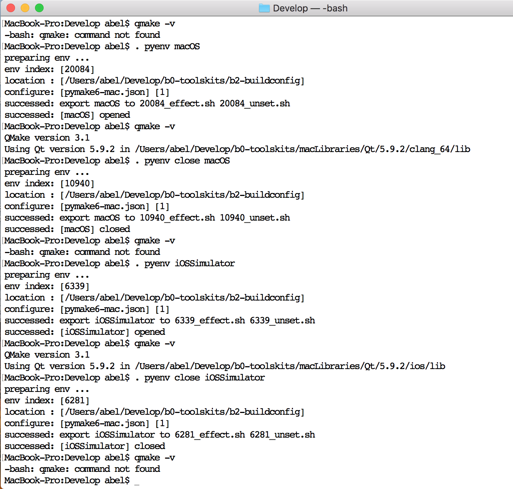

# User Support  

User support shell module, user can install them to share their functions.   

|Program|Shortcut|Shortcut(Level 2)|
|----|----|----|  
| pymake.py | pymake | mm, pymm |
| pymake.py | pyenv | pyvc |
| pymake.py | pycmd, pyexecvp | pyccvp |
| pyinfo.py | pyinfo || 
| pypaths.py | pypaths || 
| pycodec.py | | |
|  |  | install,uninstall |  

# pymake  

## 遇到的问题  
1. 打开命令行，需要查找自己写的脚本，需要切换工作目录，需要调用固定名字的命令，需要现配置环境。
2. 命令不丰富，命令步很复杂，需要写脚本，难道到处带着它，随时拷贝一下？
3. 需要切换好几个环境，可是一次只能配置一个？命令行，总这样。  
4. 路径繁杂，每次都要拷贝PATH路径。  
5. 自动化脚本写了一遍又一遍，可是还得再写一遍。  
6. 不兼容，路径不兼容、环境变量不兼容，命令不兼容，很痛苦。

## 思考过程  
制定一个目标，实现它。  
既然命令行那么难配置环境，就要用个容易配置的办法，写脚本增删路径，写多个脚本，一个脚本一个环境。不行需要找脚本路径，不方便。   
命令行写多个环境配置挺复杂的，换个工具来实现吧，反证，只要把环境配置出来就行，找个脚本语言，都是脚本，不在乎运行速率。  
使用Python，Python优美、典雅、丰富、高效。    
1. 组织数据结构，  
2. 寻找相应的办法，实现丰富的命令，
3. 测试，
4. 使用中，继续完善，
5. 多更新几版，表达其完善度。  
6. 发布。   

## 解决方法  
使用pymake，初始，摁着电脑，配置一次路径集、环境集、命令集，命令集随时可以扩充。在工作目录打开命令行，哦，到这里工作基本上就要做完了。执行下命令，去喝茶。    
1. 没错，只有一步，在工作目录打开命令行，工作基本上就要做完了。  
2. 输入一条命令。  
3. 命令简写，还带参数。  

```shell

#获取所有的PyMake信息，包含环境配置在哪里、是哪个配置文件（一般为一台电脑的某组配置）、程序目录、PORT目录、程序配置目录。
#包含当前环境、安装路径。
pymake get all

#获取环境配置SOURCE
pymake source

#获取当前env
pymake get cur env

#查看env
pymake env

#查看cmd
pymake see 
pymake use <env> see

#查看path
pymake list path

#设置默认环境
pymake set cur env

#导出一个环境
pymake export

#导出一个命令（其实是个命令步的集合）
pymake type
pymake use <env> type

#执行命令
pymake exec 
pymake use <env> exec
pymake execvp 
pymake use <env> execvp

#备份所有环境配置到zip。
pymake backup

#重置PyMake
pymake initialize

#传输源环境配置文件的信息到目标环境配置文件
pymake port
pymake translate

#导入命令脚本为内部命令
pymake import

#--------------------------------------------------------------------------------
#设置环境、PATH、CMD具体内容
pymake set

#查看是否包含某环境、PATH、CMD名
pymake have

#清理执行后的残余脚本，包含_exec.bat, _effect.bat, _unset.bat ...
pymake clean

#获取程序信息
pymake program

#其他的命令都是别名


```

pymm, mm是pymake的别名。  

## pymake使用截图  
  


# pyenv   

pymake可以帮助用户配置并保存多变的环境变量和路径，甚至可以保存命令。用户可以随时切换环境，编写的shell中也可以随时切换环境，代码简单。  
pymake能够给用户提供一个不会干扰系统环境、并且互不干扰的环境，还随处可以调用！这是一个创举。  

在pymake的基础上，我制作了pyenv。    
pyenv在被安装后也可以随处运行，他的特点在于，用户可以在命令行里随意开关（即更换）自有的环境。    
pyenv为用户提供了影响当前运行器的环境！这又是一个创举。      

## pyenv 使用截图  
  
  
  
  


# pyvc  

pyvc为用户设置VC环境提供便利。  
用户在自己的环境集.json里面使用MSVC的环境配置两个变量 VCVARSALL 和 VCVARSALLPARAM 就可以使用。

#### pyvc 的使用条件  
1. 注意  
在\<source-root>/\<source-file>.json，即\$(mm source)文件里面添加，  
在每个使用MSVC的ENV配置里必须加入两个环境变量，  
"VCVARSALL"="\${vcvarsall-201x}"，\${vcvarsall-201x} 路径集保存到 path-assemblage。    
"VCVARSALLPARAM"="amd64_x86"，这个环境变量根据ENV的目标决定。     
只有这样，pyvc.bat 才能执行有效。   

2. 注意  
bat环境变量不区分大小写。  
允许增加"RUN-VCVARSALL"="\"\${VCVARSALL}\" \${VCVARSALLPARAM}"。  
用户自行决定配置"CLS-VCVARSALL"和"CLS-VCVARSALLPARAM"。  

#### pyvc 使用注意    
1. 这里说一下，vcvarsall.bat 是一种更换环境后全覆盖式的，其实没有清理。
但是，pyvc支持清理，环境变量 CLS-VCVARSALL 就是清理命令，CLS-VCVARSALLPARAM 是参数。
用户配置到环境集.json相应ENV中即可。也是两个环境变量。
当然，用户自行决定从何处获取清理VC环境的.bat。  
一般不需要。   
2. 环境变量 VCVARSALL VCVARSALLPARAM 已经被使用者设置进入确定的ENV，随时跟着ENV改变。  


