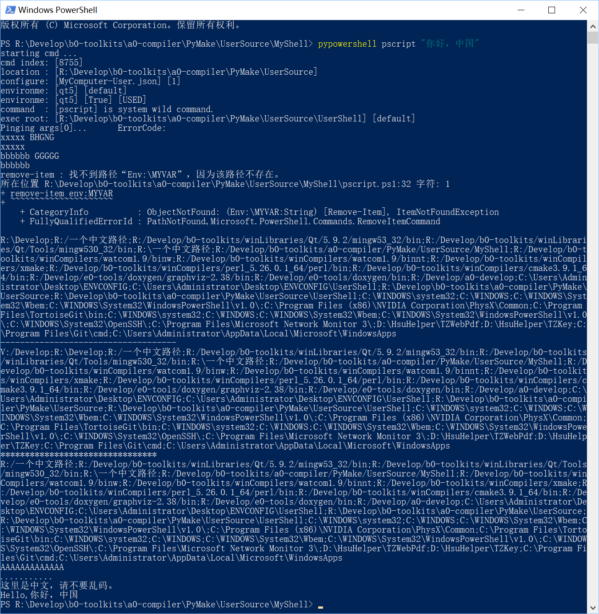

# User Support  
User support shell module, user can install them to share their functions.   

# 使用说明  
|影响当前执行器 [PyMake并行]| 不影响当前执行器 [PyMake串行]| 备注 ||
|-----|-----|-----|-----|  
|pyenv qt5| pymake set cur env qt5|||
|pytype test.3 bbc qt5| pytype test.2 abc |||
|bbc_exec.bat| abc_exec.bat|都能执行PyMake保存的命令|||
|java -v|pypowershell xxx ... ||||
| |pylanguage xxx ...||
| |pycmd test.4|||
| |pyexecvp test.5 ...|||||
| |pyccvp test.5 ...||||||
|set | pyccvp set|都能执行系统路径里的命令||||
|php xxx ... | pyccvp php xxx ... |都能执行自定路径里的命令||||
|pyenv close qt5| | |
|pyvc msvc2015| pymake set cur env msvc2015 | 都能开启新环境执行命令|
|CL.exe ... | pyccvp CL.exe ... | |
|pyvc close msvc2015| | |
|pyclean | pyclean| 清理掉从PyMake导出的命令 |

说明：前者，一直影响当前环境，后者，一直没影响当前环境。    
说明：前者，难度较大，后者，比较容易理解和使用。  
说明：前者和后者，不要混淆使用。  

# pymake  

## 遇到的问题  
1. 打开命令行，需要查找自己写的脚本，需要切换工作目录，需要调用固定名字的命令，需要现配置环境。
2. 命令不丰富，命令步很复杂，需要写脚本，难道到处带着它，随时拷贝一下？
3. 需要切换好几个环境，可是一次只能配置一个？命令行，总这样。  
4. 路径繁杂，每次都要拷贝PATH路径。  
5. 自动化脚本写了一遍又一遍，可是还得再写一遍。  
6. 不兼容，路径不兼容、环境变量不兼容，命令不兼容，很痛苦。

## 思考过程  
制定一个目标，实现它。  
既然命令行那么难配置环境，就要用个容易配置的办法，写脚本增删路径，写多个脚本，一个脚本一个环境。不行需要找脚本路径，不方便。   
命令行写多个环境配置挺复杂的，换个工具来实现吧，反证，只要把环境配置出来就行，找个脚本语言，都是脚本，不在乎运行速率。  
使用Python，Python优美、典雅、丰富、高效。    
1. 组织数据结构，  
2. 寻找相应的办法，实现丰富的命令，
3. 测试，
4. 使用中，继续完善，
5. 多更新几版，表达其完善度。  
6. 发布。   

## 解决方法  
使用pymake，初始，摁着电脑，配置一次路径集、环境集、命令集，命令集随时可以扩充。在工作目录打开命令行，哦，到这里工作基本上就要做完了。执行下命令，去喝茶。    
1. 没错，只有一步，在工作目录打开命令行，工作基本上就要做完了。  
2. 输入一条命令。  
3. 命令简写，还带参数。  

```shell

#获取所有的PyMake信息，包含环境配置在哪里、是哪个配置文件（一般为一台电脑的某组配置）、程序目录、PORT目录、程序配置目录。
#包含当前环境、安装路径。
pymake get all

#获取环境配置SOURCE
pymake source

#获取当前env
pymake get cur env

#查看env
pymake env

#查看cmd
pymake see 
pymake use <env> see

#查看path
pymake list path

#设置默认环境
pymake set cur env

#导出一个环境
pymake export

#导出一个带“在sourceroot里自定义的”环境的环境
pymake export2

#导出一个命令（其实是个命令步的集合）
pymake type
pymake use <env> type

#执行命令
pymake exec 
pymake use <env> exec
pymake execvp 
pymake use <env> execvp

#备份所有环境配置到zip。
pymake backup

#从zip还原所有的备份环境。
pymake recovery

#重置PyMake
pymake initialize

#传输源环境配置文件的信息到目标环境配置文件
pymake port
pymake translate

#导入命令脚本为内部命令
pymake import

#--------------------------------------------------------------------------------
#设置环境、PATH、CMD具体内容
pymake set

#查看是否包含某环境、PATH、CMD名
pymake have

#清理执行后的残余脚本，包含_exec.bat, _effect.bat, _unset.bat ...
pymake clean

#获取程序信息
pymake program

#其他的命令都是别名
#pymm, mm是pymake的别名。  

```


``` shell
#查看PyMake提供的local环境
pymake local 

#开启“在sourceroot里定义的”自定义环境
pymake custom open

#假设shellroot里有shat.bat，现在在随意的目录里打算执行他。  
pymake exec shat

#希望在当前目录执行他。
pymake exec here shat

#希望在某个任意的目录执行他。
pymake exec-with-params shat --workroot "xxx-path"

#希望带参数执行他。
pymake exec-with-params shat --params "xxxx xxxx xxxx"  

#希望满足多个条件执行他。
pymake exec-with-params [ here ] shat --params="xxxx" --workroot="xxx"

``` 

```powershell

#希望使用powershell执行器执行命令
pymake powershell 

#命令别名
pypowershell

```

```cmd
#查看系统环境 [system]
pymake system

#查看PyMake提供的环境
pymake local 

#查看自定义环境 [custom]
pymake custom

#查看独立环境 [separate]
pymake env current -r

# 另外一组查看环境的命令
pymake get all settings --local --custom --system --current --envname <env-name>

```

```cmd
# 使用其他语言执行命令
pymake language exec-with-params php --params xxx.php --params ...

#language命令的快捷方式
pylanguage php xxx.php ...

```

#### pymake使用截图  
  


# pyenv   

pymake可以帮助用户配置并保存多变的环境变量和路径，甚至可以保存命令。用户可以随时切换环境，编写的shell中也可以随时切换环境，代码简单。  
pymake能够给用户提供一个不会干扰系统环境、并且互不干扰的环境，还随处可以调用！这是一个创举。  

在pymake的基础上，我制作了pyenv。    
pyenv在被安装后也可以随处运行，他的特点在于，用户可以在命令行里随意开关（即更换）自有的环境。    
pyenv为用户提供了影响当前运行器的环境！这又是一个创举。      

#### pyenv 使用截图  
  
  
  
  


# pyvc  

pyvc为用户设置VC环境提供便利。  
用户在自己的环境集.json里面使用MSVC的环境配置两个变量 VCVARSALL 和 VCVARSALLPARAM 就可以使用。

#### pyvc 的使用条件  
1. 注意  
在<source-root>/<source-file>.json，即$(mm source)文件里面添加，  
在每个使用MSVC的ENV配置里必须加入两个环境变量，  
"VCVARSALL"="${vcvarsall-201x}"，${vcvarsall-201x} 路径集保存到 path-assemblage。    
"VCVARSALLPARAM"="amd64_x86"，这个环境变量根据ENV的目标决定。     
只有这样，pyvc.bat 才能执行有效。   

2. 注意  
bat环境变量不区分大小写。  
允许增加"RUN-VCVARSALL"="\"${VCVARSALL}\" ${VCVARSALLPARAM}"。  
用户自行决定配置"CLS-VCVARSALL"和"CLS-VCVARSALLPARAM"。  

#### pyvc 使用注意    
1. 这里说一下，vcvarsall.bat 是一种更换环境后全覆盖式的，其实没有清理。
但是，pyvc支持清理，环境变量 CLS-VCVARSALL 就是清理命令，CLS-VCVARSALLPARAM 是参数。
用户配置到环境集.json相应ENV中即可。也是两个环境变量。
当然，用户自行决定从何处获取清理VC环境的.bat。  
一般不需要。   
2. 环境变量 VCVARSALL VCVARSALLPARAM 已经被使用者设置进入确定的ENV，随时跟着ENV改变。  

#### pyvc 使用截图  
  

# pypowershell  

pypowershell允许用户在PyMake提供的多个环境里，使用powershell执行命令。  
pypowershell提供pypowershell.bat，用户既可以使用CMD执行器，也可以使用powershell执行器。  
pypowershell还提供pypowershell.sh，可以跨平台使用。      
用户可以在一个目录里调用任何目录下的.ps1，而且，当作命令来调用，支持输入参数，支持任意工作目录。  
支持powershell，是个开创性动作。   

  

# pyenv [.ps1]  

pypowershell允许用户在CMD、POWERSHELL等环境里执行powershell命令，但是，pypowershell执行时不会影响当前执行器的环境。  

pyenv提供三个Shortcut来影响当前执行器的环境，  
pyenv.bat来影响CMD执行器的环境，  
pyenv.sh来影响SHELL执行器的环境，  
pyenv.ps1就是来影响powershell执行器的环境的，能够跨平台使用。  

#### pyenv [.ps1] 使用截图  
  
