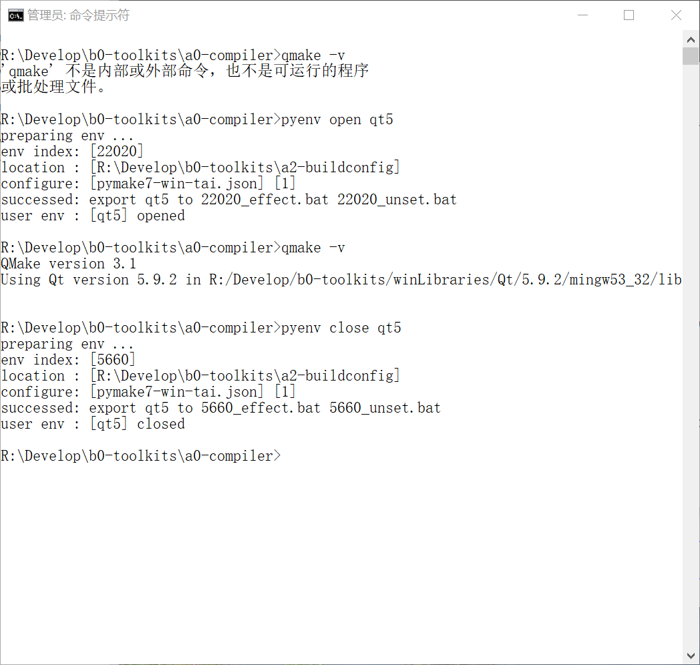

# USERSUPPORT SHELL MODULE  

User support shell module, user can install them to share their functions.   
- pyenv  
- pyvc  
- ...   

# pyenv   

pymake可以帮助用户配置并保存多变的环境变量和路径，甚至可以保存命令。用户可以随时切换环境，编写的shell中也可以随时切换环境，代码简单。  
pymake能够给用户提供一个不会干扰系统环境、并且互不干扰的环境，还随处可以调用！这是一个创举。  

在pymake的基础上，我制作了pyenv。    
pyenv在被安装后也可以随处运行，他的特点在于，用户可以在命令行里随意开关（即更换）自有的环境。    
pyenv为用户提供了影响当前运行器的环境！这又是一个创举。      

## pyenv 使用截图  
  
  
  
  

# pyvc  

pyvc为用户设置VC环境提供便利。  
用户在自己的环境集.json里面使用MSVC的环境配置一个变量RUN-VCVARSALL就可以使用。

#### pyvc 的使用条件
在 <source-root>/<source-file>.json，即 $(mm source root) 里面添加，  
在每个使用 MSVC 的 ENV 里必须加入一个环境变量，"RUN-VCVARSALL"="${vcvarsall-201x} amd64 ..."，${vcvarsall-201x} 路径集合保存到 path-assemblage。  
只有这样，pyvc.bat 才能执行有效。  

#### pyvc 使用注意  
1. 这里说一下，vcvarsall.bat 是一种更换环境后全覆盖式的，其实没有清理。但是，pyvc支持清理，环境变量 CLS-VCVARSALL就是清理命令，用户配置到环境集.json相应 ENV 中即可。当然，用户自行决定从何处获取清理VC环境的.bat。   
2. 环境变量 RUN-VCVARSALL 已经被使用者设置进入确定的ENV，随时跟着ENV改变。  

